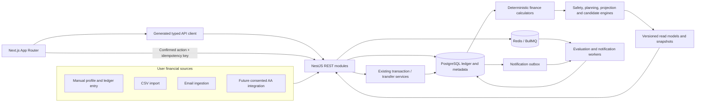

# Financial Copilot Architecture

## Requirements

### Functional

- Accept a versioned net in-hand salary and optional CTC, work schedule, other income, protection, and debt facts.
- Derive essential burn from posted ledger expenses rather than user-entered display totals.
- Translate eligible liquid reserves into survival time.
- Evaluate a sequential safety ladder with explicit unmet checks.
- Generate salary-day and month-end plans without moving money automatically.
- Extend goals with templates, inflation-aware calculators, and feasibility analysis.
- Classify wealth into emergency, stability, and growth functions without duplicating values.
- Run passive-income, SIP, FIRE, and opportunity-cost scenarios from explicit assumptions.
- Rank a single next action from deterministic evidence.
- Provide optional AI narration only after numeric and reference validation.

### Non-functional

- **Correctness:** no floating-point money, no mutable ledger history, no double-counted transfers, and reproducible results for a stored input snapshot.
- **Explainability:** every status, projection, and action exposes inputs, assumptions, formula version, data freshness, and missing-data limitations.
- **Security:** salary, insurance, debt, and provider-bound content are confidential user data; never log raw values or free text unnecessarily.
- **Reliability:** scheduled work is idempotent, retryable, resumable, and safe to run more than once.
- **Performance:** dashboard read models target 200 ms p95 from precomputed or bounded queries; heavy backfills run in BullMQ.
- **Maintainability:** remain a modular monolith with clear NestJS modules and feature-sliced Next.js code.
- **Operations:** no new infrastructure dependency is required for the initial release.

## System shape

## Module ownership

| Capability                      | Owning module                                            | Writes money?                             |
| ------------------------------- | -------------------------------------------------------- | ----------------------------------------- |
| Salary and protection facts     | `financial-profiles` (new)                               | No                                        |
| Ledger and account balances     | existing `transactions`, `accounts`, `balances`          | Yes, through `withTxn`                    |
| Essential-burn calculation      | `financial-safety` (new)                                 | No                                        |
| Reserve source metadata         | `financial-safety`                                       | No                                        |
| Goal progress                   | existing `goals`, extended                               | Only existing contribution/transfer paths |
| Payday plans                    | `payday-plans` (new)                                     | No; confirmed steps delegate              |
| Wealth classification and drift | `wealth-allocation` (new)                                | No                                        |
| Projection scenarios            | `financial-projections` (new)                            | No                                        |
| Side-income classification      | `income-streams` (new or transaction metadata extension) | No                                        |
| Recommendation ranking          | `financial-copilot` (new)                                | No                                        |
| Notifications                   | existing `notifications` outbox                          | No ledger writes                          |

## Data flow and trust boundaries

1. Runtime inputs are parsed into shared Zod contracts.
2. Repositories fetch tenant-scoped ledger and metadata rows.
3. Pure calculators accept parsed inputs and return integer-valued results plus evidence.
4. Services attach timestamps, formula versions, policy versions, and data-quality status.
5. Expensive or scheduled results are persisted as immutable evaluation snapshots.
6. Controllers return shared response schemas; the generated client is the only frontend API boundary.
7. Frontend components format and visualize results but do not recompute canonical finance outcomes.
8. A user-confirmed allocation step calls an existing mutation service with a fresh idempotency key.

## Failure modes

| Failure                                    | Required behavior                                                                              |
| ------------------------------------------ | ---------------------------------------------------------------------------------------------- |
| Missing salary                             | Show a setup action; do not infer affordability or life-hour values                            |
| Less than three complete burn months       | Mark runway confidence as limited and show the covered window                                  |
| Stale asset valuation                      | Exclude or flag it according to source policy; never silently treat stale value as liquid cash |
| Duplicate scheduler execution              | Unique evaluation key returns the existing snapshot                                            |
| Queue unavailable                          | Current reads continue; scheduled status is marked stale                                       |
| Recommendation conflict                    | Safety and debt candidates outrank wealth acceleration deterministically                       |
| Projection overflow or invalid assumptions | Reject with a domain problem; never clamp silently                                             |
| AI provider failure                        | Return deterministic copy and keep the action usable                                           |
| User changes historical salary             | Append a new effective-dated version or correct through an audited replacement workflow        |

## Significant decisions

- [ADR-0001: Extend the modular monolith](./adr/0001-modular-monolith.md)
- [ADR-0002: Keep planning derived from the ledger](./adr/0002-ledger-derived-planning.md)
- [ADR-0003: Make deterministic engines authoritative](./adr/0003-deterministic-engines.md)
- [ADR-0004: Bound the initial product as education and planning](./adr/0004-education-boundary.md)

## Review gates

Architecture review is required when implementation proposes a parallel balance, an external provider, automatic bank execution, a named security recommendation, a mutable evaluation history, a controller-to-repository shortcut, or a slow operation inside `withTxn`.
