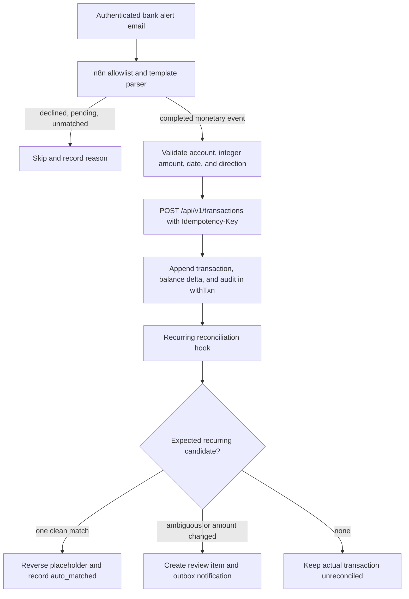

# Email-alert ingestion, payment context, and recurring reconciliation

- **Status:** Proposed
- **Date:** 2026-08-02
- **Product boundary:** Private, single-user expense tracking. No merchant intelligence, shared counterparty profiles, advertising data, or cross-user learning.

## Decision summary

TreasuryOps should continue using `POST /api/v1/transactions` for trusted n8n email-alert ingestion. The core transaction API already carries the monetary fact: account, direction, amount, occurrence time, and source description. API-key-created transactions already trigger the existing recurring reconciliation hook.

Three concepts must remain separate:

| Concept              | Question answered                      | Current values or proposed values                |
| -------------------- | -------------------------------------- | ------------------------------------------------ |
| Transaction `type`   | What did the money do to this account? | `expense`, `income`                              |
| Transaction `source` | How did the record enter TreasuryOps?  | `manual`, `csv_import`, `recurring`, `api`       |
| Payment `rail`       | How did the money move?                | `upi`, `card`, `neft`, `imps`, `nach`, `unknown` |

`type` must not be expanded with values such as `upi` or `card`. A UPI payment can be an expense, income, refund, or transfer; a card transaction can be a purchase or refund. Payment rail is orthogonal evidence.

The recommended rollout is:

1. **Now:** n8n posts a conservative `expense` or `income` and a standardized description containing explicit rail and reference clues. No transaction API change is required.
2. **Now that the narration normalizer has merged:** adopt it in server-side consumers so they derive `paymentRail`, counterparty clues, and references from `transactions.description` in memory.
3. **Only when exact source evidence is required:** add an optional `paymentContext` request object and an append-only `transaction_payment_evidence` table. Persist explicit evidence supplied by the source, not derived normalization output.
4. **Recurring UX:** mark one expected occurrence as reconciled/paid while leaving the recurring rule active for its next occurrence.

## Requirements

### Functional

- Ingest supported bank email alerts parsed by a private n8n workflow.
- Create exactly one ledger transaction for one successfully completed monetary event.
- Skip declined, pending, informational, and unsupported emails.
- Preserve explicit payment evidence such as UPI RRN, VPA, or card mandate reference where useful.
- Reconcile a real email-derived transaction against an existing scheduled recurring transaction.
- Keep the actual bank-observed transaction and reverse the scheduled placeholder on a clean match.
- Route ambiguous, changed-amount, and conflicting evidence to review.
- Represent "paid" at the occurrence level; never permanently complete an ongoing monthly rule.

### Non-functional

- Integer paise only; n8n must not calculate money with `parseFloat()`.
- Every POST is idempotent using a key derived deterministically from the source message identity.
- Original ledger descriptions remain unchanged after creation.
- No raw email body, API key, VPA, RRN, or personal narration in logs or metric labels.
- Every database read and write remains tenant-scoped by session-derived `userId`.
- New evidence persistence, if introduced, is additive and written in the same `withTxn` transaction as the ledger entry and audit record.
- Existing API clients remain backward compatible.

## Current system behavior

The current transaction contract accepts:

```json
{
  "accountId": "00000000-0000-4000-a000-000000000001",
  "type": "expense",
  "amountMinor": 29900,
  "occurredAt": "2026-07-17T00:00:00+05:30",
  "description": "CARD/EMANDATE/YOUTUBE/SIHUB:example-reference"
}
```

The server derives `source` from authentication. An API key produces `source: "api"`; callers cannot choose or spoof the source or `userId`.

After a new API-sourced transaction commits, `TransactionService` invokes `RecurringReconciliationService`. The current matcher searches already-materialized recurring transactions using:

- same account;
- same transaction type;
- occurrence date within three calendar days; and
- exact amount for automatic matching.

Outcomes are:

| Match result                                | Current behavior                                                      |
| ------------------------------------------- | --------------------------------------------------------------------- |
| No candidate                                | Keep the incoming transaction; no reconciliation row                  |
| One exact candidate                         | Reverse the scheduled recurring transaction and record `auto_matched` |
| Multiple exact candidates                   | Record `ambiguous` and notify for review                              |
| Same account/type/date but different amount | Record `amount_mismatch` and notify for review                        |

This means the basic email-to-recurring flow already works without changing `POST /api/v1/transactions`.

## End-to-end flow



## Example: a successful card e-mandate

Example email fact pattern:

```text
YouTube bill paid through E-mandate
Credit card ending ••1234
Amount INR 299.00
Date 17/07/2026
SI Hub ID example-reference
```

n8n should classify it as:

```js
{
  skip: false,
  template: "hdfc_emandate_paid",
  last4: "1234",
  type: "expense",
  amountMinor: 29900,
  occurredAt: "2026-07-17T00:00:00+05:30",
  description: "CARD/EMANDATE/YOUTUBE/SIHUB:example-reference"
}
```

The corresponding recurring rule should remain active:

```text
Account: mapped credit-card account
Type: expense
Amount: 29900 paise
Schedule: monthly around day 17
Description: YouTube
```

When the actual email-derived transaction matches the scheduled transaction:

```text
July scheduled placeholder -> reversed
July actual card charge     -> remains posted
July occurrence             -> reconciled / paid
Recurring rule              -> remains active
Next occurrence             -> August
```

The recurring **rule** is not "done". Only its July **occurrence** is satisfied.

## n8n classification policy

Email wording is evidence, not a universal accounting rule. Use an allowlisted template cascade and abstain on unknown text.

| Email evidence                                     | Proposed action                                                                     |
| -------------------------------------------------- | ----------------------------------------------------------------------------------- |
| Account or card "debited" for a completed purchase | Post `expense`                                                                      |
| Account "credited" with salary or incoming payment | Post `income`                                                                       |
| Refund or reversal credited                        | Do not classify as ordinary income; reconcile or review for a compensating reversal |
| Movement between the user's own accounts           | Use the transfer workflow, not income/expense                                       |
| Credit-card bill payment                           | Transfer/reconciliation event, not another expense                                  |
| Successful recurring card e-mandate purchase       | Post `expense`; let recurring reconciliation match it                               |
| Upcoming e-mandate notice                          | Skip; no money moved                                                                |
| Declined or failed transaction                     | Skip; no money moved                                                                |
| Unknown or conflicting wording                     | Skip and notify for review                                                          |

### Money parsing

n8n must parse the decimal representation into integer paise without binary floating-point arithmetic:

```js
function toMinor(value) {
  const normalized = value.replace(/,/g, "");
  const match = /^(\d+)\.(\d{2})$/.exec(normalized);

  if (!match) {
    throw new Error("Invalid money format");
  }

  return Number(match[1]) * 100 + Number(match[2]);
}
```

### Idempotency

- Use one deterministic UUID per source message, not one UUID per n8n execution.
- Prefer UUIDv5 or a cryptographic digest-derived UUID over replacing non-hex characters with zeroes.
- Reprocessing the same Gmail message must return the original transaction and must not create another ledger effect.
- A separate alert for the same bank transaction should ultimately be caught by the planned type-aware dedupe flow; do not rely on email message identity alone.

## Payment rail design

### Immediate recommendation: derive, do not persist

The versioned narration normalizer produces:

```ts
type NormalizedTransactionText = Readonly<{
  paymentRail: "upi" | "neft" | "imps" | "nach" | "card" | "unknown";
  counterpartyKey: string | null;
  counterpartyHandle: string | null;
  referenceTokens: readonly Readonly<{
    kind: "rrn" | "utr" | "order" | "other";
    value: string;
  }>[];
  // Additional normalized fields omitted here.
}>;
```

Consumers can call the normalizer with the stored description when categorizing, detecting recurrence, reconciling, or computing dedupe evidence. This avoids a migration and keeps versioned derived fields recomputable.

Standardized n8n descriptions should make explicit evidence recoverable:

```text
UPI/DR/076443825714/COUNTERPARTY/counterparty@provider
CARD/EMANDATE/YOUTUBE/SIHUB:example-reference
NEFT/CR/UTR:example-utr/COUNTERPARTY
IMPS/DR/REF:example-reference/COUNTERPARTY
```

### Target recommendation: optional explicit payment context

If exact mandate/reference matching proves valuable, introduce an additive optional object rather than changing `type` or `source`:

```ts
type CreateTransactionPaymentContext = Readonly<{
  rail: "upi" | "neft" | "imps" | "nach" | "card" | "unknown";
  counterpartyHandle?: string;
  reference?: Readonly<{
    kind: "rrn" | "utr" | "other";
    value: string;
  }>;
  mandateReference?: string;
  parser: Readonly<{
    source: "email_alert";
    template: string;
    version: number;
  }>;
}>;
```

Proposed backward-compatible request:

```json
{
  "accountId": "00000000-0000-4000-a000-000000000001",
  "type": "expense",
  "amountMinor": 29900,
  "occurredAt": "2026-07-17T00:00:00+05:30",
  "description": "CARD/EMANDATE/YOUTUBE/SIHUB:example-reference",
  "paymentContext": {
    "rail": "card",
    "mandateReference": "example-reference",
    "parser": {
      "source": "email_alert",
      "template": "hdfc_emandate_paid",
      "version": 1
    }
  }
}
```

This is a design target, not part of the current API. The authoritative contract must be added to `packages/shared` as zod schemas, exposed through the generated OpenAPI specification, and consumed through the generated web client.

The API must never accept:

- `userId` from the body;
- `source` from the body;
- a narration-derived `counterpartyKey` from n8n;
- a direction hint that can override `type`; or
- arbitrary raw email HTML.

### Persistence boundary

Do not add payment columns directly to the monetary transaction fields. If explicit source evidence is persisted, use an additive one-to-one table such as:

```text
transaction_payment_evidence
  id
  user_id
  transaction_id
  payment_rail
  counterparty_handle nullable
  reference_kind nullable
  reference_value nullable
  mandate_reference nullable
  parser_source
  parser_template
  parser_version
  created_at
```

Rules:

- Repository methods take `userId` first and filter by it.
- Evidence is inserted in the same `withTxn` transaction as the transaction, balance update, and audit event.
- Evidence rows are append-only; corrections accompany a compensating transaction rather than rewriting monetary history.
- Add a tenant-scoped uniqueness constraint for explicit reference values only after collision behavior is evaluated.
- Do not persist normalized text, tokens, or `counterpartyKey` in this phase.
- Do not log evidence values.

## Recurring reconciliation improvements

### Current limitation

Current automatic reconciliation does not compare description, normalized counterparty, VPA, or mandate reference. A unique same-account, same-type, same-amount transaction within the date window can auto-match even if the counterparty differs.

Multiple equal candidates become `ambiguous`, which is safe, but a single wrong candidate can still be selected when two different subscriptions do not both have scheduled placeholders.

### Recommended matching order

After narration normalization is available, rank evidence in this order:

1. Exact tenant-scoped mandate/reference match, when the reference is known to be stable.
2. Same recurring rule plus expected occurrence window, when an explicit server-validated rule relationship exists.
3. Same account, type, normalized private counterparty key, date window, and exact amount.
4. Same account, type, counterparty, and date window with amount mismatch: review as a possible price change.
5. Same account, type, date, and amount without counterparty evidence: review rather than automatic matching.

The parser-provided `type` and payment evidence never override ledger invariants. A conflict causes abstention or review.

### Email arriving before materialization

The current matcher looks for an already-created recurring transaction. If the real email arrives before the scheduler materializes that occurrence, it finds no candidate and the later scheduler can create a duplicate placeholder.

Mitigate this with one of these bounded approaches:

1. Run a tenant-scoped reconciliation sweep after materialization to revisit recent unmatched API transactions.
2. Match incoming evidence directly against expected rule occurrences, then suppress only that specific materialization through an idempotent occurrence claim.

Start with the sweep because it is operationally simpler and preserves the current materializer. The sweep must be retry-safe, tenant-scoped after system discovery, and tested for concurrent execution.

### Occurrence read model

Expose a derived recurring-occurrence status without editing historical transactions:

```text
expected     Scheduled occurrence exists but no real transaction has matched
reconciled   Actual transaction matched and placeholder was reversed
needs_review Ambiguous candidate or amount changed
missed       Grace window elapsed without an observed payment
```

Suggested future collection resource:

```http
GET /api/v1/recurring/{ruleId}/occurrences?cursor=...&limit=50
```

This endpoint uses cursor pagination, validates tenant ownership, and returns references to transactions and reconciliation evidence rather than duplicating ledger data.

## Authentication and security

- Rotate any API key that has appeared in chat, source code, logs, or notifications.
- Store the replacement in n8n Credentials; never hardcode it in a Code node or commit it.
- Grant only the `transactions:write` permission required by the workflow.
- Restrict the workflow to exact sender addresses and validate available Gmail authentication results; display names are not trustworthy.
- Use HTTPS or a trusted isolated network because HTTP exposes the bearer key and financial data to network observers.
- Do not send full transaction descriptions, VPAs, references, API errors, or account identifiers to a public notification topic.
- Cap body lengths and allowlist supported templates before any API request.
- Unknown emails must fail closed: skip and notify without creating money.
- RFC 7807 responses from the API should be handled by status/code; avoid publishing raw response bodies to notifications.

## Failure modes and recovery

| Failure                                         | Required behavior                                                                   |
| ----------------------------------------------- | ----------------------------------------------------------------------------------- |
| n8n retries after timeout                       | Same idempotency key returns original transaction                                   |
| Parser cannot map account suffix                | Skip and notify; never choose a default account                                     |
| Decimal amount is malformed                     | Reject before API request                                                           |
| Email says both debit and credit                | Skip as conflicting evidence                                                        |
| Declined or upcoming mandate                    | Skip because no money moved                                                         |
| API transaction succeeds but notification fails | Keep transaction; notification retry must not repeat the POST                       |
| Reconciliation hook fails                       | Keep transaction and retry through a reconciliation sweep                           |
| Two possible recurring candidates               | Create review item; do not auto-reverse either                                      |
| Subscription price changes                      | Keep actual amount and request review; never edit the historical placeholder amount |
| Duplicate reference from another user           | Tenant isolation prevents cross-user matching                                       |

## Delivery plan

### Stage A — n8n hardening, no API change

- Rotate and relocate the API credential.
- Replace floating-point money parsing with integer decimal parsing.
- Capture UPI VPA/RRN and card e-mandate SI Hub reference.
- Emit standardized descriptions.
- Keep strict skip reasons for declined, upcoming, unmatched, transfer, bill-payment, refund, and conflicting messages.
- Use stable cryptographic idempotency UUIDs.

### Stage B — integrate the merged narration normalizer

- Reuse the merged private narration normalizer rather than creating email-specific text parsing inside recurring services.
- Use normalized private counterparty evidence in recurring matching.
- Keep exact amount/date-only matches as review candidates until measured false-match behavior is acceptable.
- Add synthetic email-derived fixtures without committing real account numbers, message IDs, VPAs, or references.

### Stage C — explicit payment evidence, only if justified

- Add shared zod-derived `paymentContext` input schemas.
- Add an additive `transaction_payment_evidence` migration.
- Insert evidence through the transaction service and repository inside `withTxn`.
- Regenerate OpenAPI and the typed web client.
- Add tenant-isolation, idempotency, concurrency, and append-only integration tests.
- Keep existing clients valid when `paymentContext` is absent.

### Stage D — recurring occurrence UX and recovery

- Add reconciliation sweep for email-before-materialization and hook-failure recovery.
- Add the cursor-paginated occurrence read model.
- Display `expected`, `reconciled`, `needs_review`, and `missed` per occurrence.
- Keep the recurring rule active unless the user explicitly pauses it.

## Acceptance criteria

1. A successful supported debit email creates one expense in integer paise.
2. A supported incoming credit creates income only when it is not a refund, reversal, bill payment, or own-account transfer.
3. A declined, pending, upcoming-mandate, unmatched, or conflicting email creates no transaction.
4. Replaying one email five times produces exactly one ledger effect.
5. A YouTube e-mandate matching one scheduled occurrence keeps the real transaction, reverses the placeholder, records reconciliation, and leaves the rule active.
6. Two equally plausible recurring candidates produce review rather than automatic reversal.
7. A changed subscription amount produces review and never rewrites prior money.
8. Payment rail is available as derived evidence without changing transaction `type` or `source`.
9. Optional explicit payment evidence, if implemented, is tenant-scoped, append-only, and backward compatible.
10. Raw email content, credentials, account suffixes, VPAs, and reference values are absent from committed fixtures, logs, metrics, and public notifications.

## Architecture decisions

### ADR-1: Keep direction, ingestion source, and payment rail separate

**Decision:** Retain `type` for account direction, retain server-derived `source` for ingestion origin, and represent payment rail as separate evidence.

**Reason:** Conflating these dimensions makes refunds, transfers, card credits, and UPI income impossible to model correctly.

### ADR-2: Reuse the transaction endpoint for n8n

**Decision:** Continue using `POST /api/v1/transactions` for completed monetary events.

**Alternative rejected:** A bank-email-specific money endpoint would duplicate validation, idempotency, transaction orchestration, balance updates, auditing, and reconciliation hooks.

### ADR-3: Derive payment context first

**Decision:** Normalize the stored description on demand before adding persistence.

**Trade-off:** This is inexpensive and versionable at personal-finance scale, but exact external references are harder to query. Add explicit evidence storage only when mandate/reference matching requires it.

### ADR-4: Mark occurrences, not rules, as paid

**Decision:** A reconciliation satisfies one occurrence. The recurring rule remains active and advances to its next occurrence.

**Reason:** Completing the rule after one successful monthly charge would incorrectly stop future expectations and forecasts.

## Addendum — 2026-08-02: codebase verification and concrete design

This section grounds the above plan against the actual code (`apps/api`, `packages/shared`) as of this date, corrects one stale assumption, and answers two follow-up questions: (1) can `POST /api/v1/transactions` accept the richer per-template evidence these emails carry without breaking existing clients, and (2) does reconciling e-mandate emails against recurring rules make sense.

### Correction: the narration normalizer is merged — Stage B is unblocked

An earlier revision of this addendum stated the narration normalizer didn't exist. That check was run against a different local checkout of the repo (a frontend feature branch forked before PR #121 merged), not this branch. `feat/finance-02-narration-normalizer` (PR #121) has since merged into `main` (`c7446d3`, 2026-08-02), and this branch's own merge-base with `main` is that exact commit — so `apps/api/src/common/transaction-text/normalize-transaction-text.ts` and `packages/shared/src/transaction-text.ts` are already present here, confirmed directly in this branch's working tree, not inferred. (This branch's `apps/api/CLAUDE.md` still describes the API as "foundation stage only," but that file is known-stale documentation lag, not a description of what's actually under `src/` — same caveat the root `CLAUDE.md` makes about itself. Don't trust it over what's actually in `apps/api/src`.) Implementation work for this plan can proceed directly on this branch.

What PR #121 actually delivers, confirmed by reading the merged source: `normalizeTransactionText(description: string): NormalizedTransactionText` — a pure, in-memory function, explicitly **not persisted anywhere** (PR body: "no database persistence or migrations... no API behavior changes"). Given a description string, it derives:

- `paymentRail`: `upi | neft | imps | nach | card | unknown`, detected from transport-noise tokens (`upi`, `neft`, `card`, `ecom`, `pos`, ...)
- `counterpartyHandle`: the UPI VPA, extracted with a delimited-pattern regex — this already parses exactly the VPA these HDFC emails show (`8169461230@axl`, `blinkit.payu@hdfcbank`)
- `counterpartyKey`: normalized, de-noised counterparty tokens joined into a matchable string
- `referenceTokens`: an array of `{ kind: rrn | utr | order | other, value }` — pulled via labeled patterns (`rrn:`, `utr:`, `order:`/`inv:`, `mandate:`/`umrn:`, plus bare 12-digit → `rrn` when the rail is UPI, bare 10+ digit → `other` otherwise) — this already covers the UPI transaction reference no. from these emails, and a `mandate:<value>` token would cover an SI Hub ID **if the description contains that literal marker**
- `directionHint`, `isFeeHint`, `isRefundHint` — debit/credit/fee/refund cues
- `normalizerVersion` — so callers can tell which parsing rules produced a given derivation

This changes the shape of the recommendation below: since Stage B is real and callable today, much of what Stage C's evidence table would store can instead be *derived on demand* from `description` at match/read time, provided n8n writes a description that contains the right tokens. No schema change is required for that path — only a documented description convention on the n8n side. Stage C (persisted `paymentContext`) is still worth keeping as a fallback for evidence the normalizer can't reliably parse from free text (e.g. distinguishing "this VPA is my landlord" from "this VPA is a phone recharge" requires more than token extraction), but it's no longer the only option, and shouldn't be built first.

### Sample email inventory (this batch)

| Template | Fields available in the email that are currently discarded |
|---|---|
| HDFC UPI debit | VPA (`8169461230@axl`), payee label (`HARSHKUMAR VINODBHAI PATEL` / `Blinkit` / `MMRDA`), UPI transaction reference no. (12-digit, e.g. `630934540626`) |
| HDFC credit card direct debit | merchant string (`HONEYCOMB TELNET PRIVA`), timestamp to the second — **no reference number in this template at all** |
| HDFC e-mandate registered | merchant, current/max transaction amount, frequency, start/end date, **SI Hub ID** (e.g. `YXc23glB3l`) — this is a rule definition, not a transaction |
| HDFC e-mandate upcoming | merchant, amount, debit date, SI Hub ID — a forecast, no money has moved |
| HDFC e-mandate paid | merchant, amount, date, SI Hub ID — the actual settlement |

Two things worth flagging while reading these:

1. **The Anthropic e-mandate-paid emails are in `USD`, not `INR`** (`Amount: USD 23.60`). The current n8n `hdfc_emandate_paid` regex hardcodes `Amount:\s?INR\s?...`, so this template silently fails to match and the row falls through to `unmatched`/skip — these charges are not being logged at all today, independent of anything in this doc. Separately, even if matched, the USD figure printed in the email is **not** what gets debited from the INR account (HDFC applies FX conversion + markup), so this template cannot safely produce `amountMinor` from its own body; there's no fix for this inside the parser alone — it needs either a follow-up "forex markup posted" email/statement line as the amount source, or this template stays a manual-entry case.
2. The credit-card-direct-debit template carries no reference number at all, so not every transaction type can carry every evidence field — the design has to make all evidence fields optional per-instance, not just optional per-request.

### Question 1: can the API accept this without breaking prod?

Yes, and cleanly, for concrete reasons found in the code rather than in the abstract:

- `CreateTransactionSchema` (`packages/shared/src/transaction.ts:15`) is a plain zod object with no `.strict()`/discriminated-union coupling to the new fields. Adding a new **optional** top-level key is additive — any existing caller (n8n's current payload, or anything else hitting this endpoint) that omits it keeps validating exactly as today; zod does not require or reject unknown-to-it-being-absent optional fields.
- The `transactions` table (`apps/api/src/common/db/schema/transaction.ts`) already has five nullable/optional FK-style columns following this exact pattern (`categoryId`, `billId`, `recurringRuleId`, `transferGroupId`, `reversalOf`), each with a partial index (`.where(sql\`... IS NOT NULL\`)`). A new evidence table follows the same idiom the schema already uses, rather than introducing a new one.
- `source` is derived server-side from `request.authMethod` in `transaction.controller.ts:68` and is never accepted from the request body — any new field must follow that precedent (evidence is *what the source observed*, never something that can override `type`, `userId`, or `source` itself).
- Migrations here are additive-only by repo convention (root `CLAUDE.md`); a `CREATE TABLE` migration (next file would be `0019_*.sql`, following `0018_flaky_morgan_stark.sql`) touches zero existing rows.
- `pnpm gen:openapi`/`gen:client` regenerate from the same zod schemas consumed by request validation, so an optional field flows through to the generated web client typed as optional automatically — no hand-written OpenAPI diff to maintain, and CI's spec-diff gate treats a new optional request field and a new optional response field as non-breaking additions, not removals/narrowings.

Concretely, this means: **don't add columns to `transactions` itself.** Add an additive 1:1 table, written in the same `withTxn` block `transaction.service.ts`'s `createAndReplay` already opens (one more insert alongside the existing `accounts.applyBalanceDelta` + `transactions.create` + `audit.record` calls, at `transaction.service.ts:83-104`):

```
transaction_payment_evidence
  id                 uuid pk
  user_id            text not null, references user.id      -- userId-first, per AGENTS.md §4
  transaction_id     uuid not null, references transactions.id, unique index (1:1)
  payment_rail       enum: upi | card | neft | imps | nach | unknown
  counterparty_handle   text nullable   -- VPA
  counterparty_name     text nullable   -- payee label from the email
  reference_kind         enum nullable: rrn | si_hub_id | other
  reference_value          text nullable  -- UPI ref no. / SI Hub ID
  parser_source, parser_template, parser_version   -- per original Stage-C proposal above
  created_at
```

Shared-schema side: a new optional `paymentContext` object on `CreateTransactionSchema`, matching the original Stage-C shape in this doc (`rail`, `counterpartyHandle?`, `reference?`, `mandateReference?`, `parser`). Repository/service change is additive: `TransactionRepository.create()` gains one more optional parameter, `TransactionService.createAndReplay` inserts the evidence row when present, nothing changes for callers that don't send it.

### Question 2: does reconciling e-mandate emails against recurring rules make sense?

Yes — and it closes a real, already-acknowledged gap rather than adding a nice-to-have. Verified in `apps/api/src/recurring/recurring-reconciliation-matcher.ts`: `matchIncomingTransaction` today has exactly two tiers, both blind to counterparty — same `accountId` + `type` + occurrence within `RECONCILIATION_WINDOW_DAYS` (3 days), then split on exact-amount vs not. This is precisely why a subscription price change or two same-priced subscriptions on one account currently produce `amount_mismatch`/`ambiguous` review rows instead of clean auto-matches (`recurring-reconciliation.service.ts:81-136` — the `RecurringReconciliationRepository.findUnreconciledRecurringCandidates` query, confirmed at `recurring-reconciliation.repository.ts:41`, only ever selects `id, recurringRuleId, accountId, type, amountMinor, occurredAt` — no reference field exists to match on today).

The e-mandate emails hand us the exact fix: the SI Hub ID is a stable per-mandate identifier shared by the *registration* email, every *upcoming* reminder, and every *paid* confirmation for the same subscription.

**Cheapest version, using what's already merged — no schema change:** since `normalizeTransactionText` already extracts a `mandate:`/`umrn:`-labeled token as a `referenceToken`, this works with zero migrations if both sides of the match embed the SI Hub ID as text in a description, by convention:

1. When a recurring rule is created for an e-mandate (by hand today, or auto-created per the phase-2 idea below), give it a `templateDescription` that embeds the token, e.g. `Anthropic (mandate:YIcCmzpAfi)`.
2. n8n's posted description for the "paid" transaction embeds the same token, e.g. `CARD/EMANDATE/Anthropic/mandate:YIcCmzpAfi`.
3. `findUnreconciledRecurringCandidates` (`recurring-reconciliation.repository.ts:41`) adds `templateDescription` to its selected columns — a one-line query change, no migration.
4. `matchIncomingTransaction` gets a **tier-0 check ahead of the existing two tiers**: call `normalizeTransactionText()` on both the incoming description and each candidate's `templateDescription`; if both have a `referenceTokens` entry with the same value, auto-match regardless of amount. This is a strictly stronger signal than amount+date and is exactly what ADR-4's "price change" scenario needs (today a subscription price increase is indistinguishable from "wrong candidate" without it).
5. "Upcoming e-mandate" emails stay skipped for transaction purposes (correct today, no money has moved) — useful only as a one-off signal to capture a mandate token onto a rule's description if it wasn't set at creation time.

**Sturdier version, if the description-convention approach proves fragile in practice:** persist the token explicitly instead of relying on text convention — a nullable `mandateReference` column directly on `recurring_rules` (`apps/api/src/common/db/schema/recurring.ts`), exposed as an optional field on `CreateRecurringRuleSchema`/`UpdateRecurringRuleSchema`, matched against the same field on the incoming transaction's `paymentContext` (Stage C, if built). Worth doing later if free-text matching turns out to be brittle (e.g. a merchant renames itself in the description but keeps the same mandate); not needed to start.

Either version leaves ADR-4 untouched: matching by mandate reference still only resolves one occurrence and leaves the rule active for its next run.

### Question 3: USD/foreign-currency e-mandates — let the user confirm the real amount

The Anthropic e-mandate-paid template's `Amount: USD 23.60` is real evidence that *a* payment happened, a rough date, and a merchant — but not the actual INR debit, because HDFC's forex conversion + markup isn't disclosed in this email. There is no parser fix for this: the true number simply isn't in the source text. Two options, not mutually exclusive:

- **Zero-code fallback (do this regardless):** give this case its own explicit skip reason in n8n's `classify()` — e.g. `foreign_currency_needs_manual_entry` — instead of letting it fall through to the generic `unmatched` bucket where it's indistinguishable from "the bank changed its email format." Route this reason to a distinct ntfy notification ("Anthropic charged $23.60 — log the INR amount from your statement") so it's at least visible instead of silently dropped, which is what happens today.
- **The actual feature being asked for — a confirm-before-posting queue:** don't let n8n guess or post a placeholder amount (the ledger has no concept of "transaction with an unknown amount" and shouldn't grow one — every posted transaction must have a real, final `amountMinor`, since it immediately drives a balance delta per `AGENTS.md`). Instead, add a small **pending-transaction** concept that mirrors a pattern already proven in this codebase — CSV imports already do "stage now, let the user edit/confirm, then commit to the real ledger" via `import_batches`/staged rows (`apps/api/src/imports/`). This case is narrower (no file, no column mapping), so it doesn't need that whole machinery, just the same shape at a smaller scale:
  - A minimal `pending_transactions` table: `id`, `userId`, `accountId`, `type`, `occurredAt`, `description` (e.g. "Anthropic — USD 23.60, INR amount pending"), `status` (`pending | confirmed | dismissed`), `resultingTransactionId` (nullable, set on confirm), `createdAt`.
  - `POST /api/v1/pending-transactions` — API-key scoped (`transactions:write` reused, or a dedicated scope), what n8n calls instead of `/v1/transactions` when it hits this skip reason. No balance delta, no ledger effect — just a row saying "something happened, needs a number."
  - `POST /api/v1/pending-transactions/:id/confirm` — session-auth only (never API-key), body `{ amountMinor }`. Internally calls the existing `TransactionService.create(...)` with `source: "manual"` (a human supplied the deciding fact, so the existing `manual` source value is the correct fit — no enum change needed), then marks the pending row `confirmed` and stores the resulting transaction id. This is the "add the exact amount while confirming, mark done" action.
  - Web UI: a small "Needs your input" list — the same shape as the existing recurring-reconciliation review queue already in the dashboard (`RecurringReconciliationReviewItem`) — where typing an amount and hitting confirm is the "mark done" the user asked for.
  - This keeps the append-only/definite-amount invariant intact: nothing touches the ledger until a real, user-supplied number exists, and the eventual transaction is created through the same single `TransactionService.create` path as everything else, so idempotency, balance updates, and audit logging all come for free.

### Net answer

All three pieces are additive and backward compatible: the mandate-matching tier-0 check can ship today with a one-line query change and zero migrations (using the already-merged normalizer); Stage C's persisted evidence table remains an optional upgrade if free-text matching proves fragile; and the foreign-currency confirm flow is a new, small, isolated table + two endpoints that never touches the existing `transactions` write path except through the same `TransactionService.create` every other source already goes through. No existing request shape, response shape, row, or matcher outcome for current data changes.
