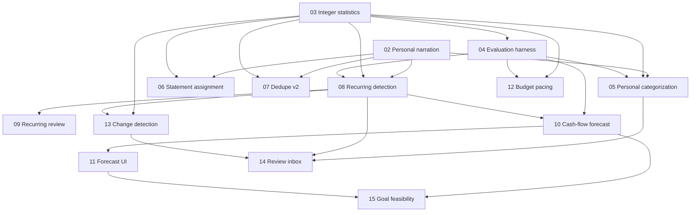

# Finance algorithms delivery and pull-request plan

**Status:** implementation sequencing plan  
**Date:** 2026-08-02  
**Research PR:** `docs/finance-01-algorithms-research`  
**Companion research:** `docs/plans/2026-08-02-finance-algorithms-research.md`

## Outcome

Deliver the personalized-finance algorithms as small, reviewable vertical changes rather than one large feature branch. The target is:

- 15 pull requests through goal feasibility, including this research PR;
- 14 implementation PRs after the research PR;
- three additional debt-simulation PRs only after the first program is measured in production;
- no investment optimization or return calculation until the asset cash-flow model is complete.

The implementation must remain focused on helping one person understand spending, avoid cash shortfalls, review recurring costs, improve budgets, protect a safety buffer, reach goals, and reduce debt. Payment-rail and counterparty parsing are private matching aids for the owner's records, not merchant intelligence or business analytics.

## Branch convention

Use the following prefixes:

- `docs/finance-XX-...` for research or planning-only work;
- `feat/finance-XX-...` for product capabilities;
- do not use an agent/tool name in a branch name;
- keep the PR number in the branch name so dependencies are visible in local worktrees and GitHub.

Each implementation branch is created from the latest `main` after its required dependencies merge. Do not create all branches in advance.

## Planned pull requests

| PR  | Branch                                      | Capability                                                                                                | Direct dependencies                 |
| --- | ------------------------------------------- | --------------------------------------------------------------------------------------------------------- | ----------------------------------- |
| 01  | `docs/finance-01-algorithms-research`       | Research, product boundaries, algorithms, rollout, and this delivery plan                                 | `main`                              |
| 02  | `feat/finance-02-narration-normalizer`      | India-aware private narration normalization for UPI, NEFT, IMPS, NACH, card, and generic fallbacks        | 01 conceptually; no code dependency |
| 03  | `feat/finance-03-integer-statistics`        | Integer median, quantile, MAD, ratios, similarity, and change-detection primitives                        | `main`                              |
| 04  | `feat/finance-04-evaluation-harness`        | Synthetic personal-finance histories, rolling-origin evaluation, decision metrics, and resource contracts | 03                                  |
| 05  | `feat/finance-05-personal-categorization`   | Rule-first, private-history category suggestions with confidence and evidence                             | 02, 03, 04                          |
| 06  | `feat/finance-06-statement-assignment`      | Global one-to-one statement reconciliation with explainable integer costs                                 | 02, 03                              |
| 07  | `feat/finance-07-dedupe-v2`                 | Type-aware exact fingerprint and near-duplicate review evidence                                           | 02, 03                              |
| 08  | `feat/finance-08-recurring-detection`       | Recurring inflow/outflow detection in backend shadow mode                                                 | 02, 03, 04                          |
| 09  | `feat/finance-09-recurring-review`          | Recurring review UI and idempotent accept/reject workflow                                                 | 08                                  |
| 10  | `feat/finance-10-cashflow-forecast`         | Forecast backend, snapshots, historical ranges, and shortfall evaluation                                  | 04, 08                              |
| 11  | `feat/finance-11-cashflow-forecast-ui`      | Personalized 30/60/90-day cash-flow UI                                                                    | 10                                  |
| 12  | `feat/finance-12-budget-pacing`             | Calendar-aware budget pace and month-end projection                                                       | 03, 04                              |
| 13  | `feat/finance-13-spending-change-detection` | Recurring-cost and personal spending-regime change detection                                              | 03, 08                              |
| 14  | `feat/finance-14-personal-review-inbox`     | Optional impact-and-uncertainty ordered review inbox                                                      | 05, 08, 13                          |
| 15  | `feat/finance-15-goal-feasibility`          | Goal affordability using conservative forecasts and a versioned safety buffer                             | 10, 11                              |

## Dependency map

## Delivery waves

### Wave 0 — research

PR 01 contains no runtime behavior. It establishes:

- personalized-expense-tracker product boundaries;
- recommended and deferred algorithms;
- integer-paise, privacy, tenancy, idempotency, and explainability rules;
- implementation order and release gates;
- the PR and branch plan.

Merge PR 01 before implementation begins so every later PR can link to one accepted technical direction.

### Wave 1 — shared foundations

PRs 02 and 03 may be developed in parallel after PR 01 merges because they should not import from one another.

PR 02 owns transaction narration:

- NFKC/lowercase/whitespace normalization;
- conservative UPI/NEFT/IMPS/NACH/card rail hints;
- private `counterpartyKey`, handle, and reference extraction;
- generic fallback and bank-specific synthetic fixtures;
- no persistence until profiling proves it necessary.

PR 03 owns mathematical primitives:

- discrete median and quantiles;
- MAD and fixed-point basis-point ratios;
- Jaccard and bounded Jaro/Jaro-Winkler scores;
- optional Soft TF-IDF helper over one user's bounded history;
- fixed-point CUSUM primitive;
- exact integer rounding and overflow tests.

PR 04 begins only after PR 03 merges. It owns evaluation, not product behavior:

- deterministic synthetic personal histories;
- chronological and rolling-origin evaluation;
- category, recurrence, forecast, shortfall, budget, and warning metrics;
- shadow/canary comparison contracts;
- worker lookback, row, runtime, and degraded-mode budgets.

### Wave 2 — immediate accuracy improvements

After PRs 02–04 merge, PRs 05–08 may be developed in parallel in separate worktrees.

PR 05 owns personal categorization end to end:

- explicit user rules remain first;
- exact private counterparty memory;
- approximate narration stages only if chronological evaluation improves;
- suggestion-only behavior, confidence, method, evidence, and abstention;
- integration with the existing import review experience;
- no automatic category mutation.

PR 06 owns statement reconciliation:

- strict candidate blocking by user, bill/account, type, amount, and date;
- global one-to-one assignment;
- description similarity as ranking evidence only;
- dummy unmatched assignments and ambiguity margins;
- no new general numerical dependency without approval.

PR 07 owns import duplicate safety:

- v2 fingerprint includes transaction type and normalizer version;
- compatibility with stored v1 hashes;
- near-duplicate score and evidence;
- human review for approximate matches;
- parallel import attempts still produce one ledger effect.

PR 08 owns recurring detection backend only:

- bounded per-user history query;
- cadence and amount-behavior scoring;
- versioned detected streams and transaction membership;
- shadow computation, input watermarks, and resource metrics;
- no automatic recurring-rule creation or ledger write.

### Wave 3 — recurring review and forecasting

PR 09 follows PR 08 and adds the first user-visible recurring workflow:

- cursor-paginated detected-stream list;
- evidence and confidence display;
- accept/reject controls;
- idempotent acceptance through existing recurring services;
- no rewriting of already posted transactions.

PR 10 follows PRs 04 and 08:

- known recurring inflows/outflows;
- credit-card bills due without purchase/payment double counting;
- variable-spend candidate models selected by rolling-origin evaluation;
- sparse-series models only for eligible personal histories;
- immutable forecast snapshots and empirical coverage;
- read-only shortfall results before notifications are enabled.

PR 11 follows PR 10 and owns presentation:

- 30-day view first, then 60/90 days only when measured accuracy permits;
- point estimate plus historical/calibrated range;
- `asOf`, sufficiency, model, assumptions, and coverage explanations;
- liquid cash excludes investments and available credit;
- generated typed API client only.

### Wave 4 — personal decisions

PR 12 may start after PRs 03 and 04, independently of forecasting:

- historical cumulative category-spend curves;
- linear fallback for insufficient history;
- projected month-end amount and utilization;
- informational UI before notification enablement.

PR 13 follows PRs 03 and 08:

- recurring amount-change evidence;
- fixed-point CUSUM with warm-up, persistence, and reset rules;
- derived stream/regime versions;
- no fraud claims and no silent recurring-rule edit.

PR 14 follows PRs 05, 08, and 13:

- optional review items from category, recurrence, and changes;
- transparent priority from uncertainty, personal amount significance, downstream impact, and staleness;
- dismissal and feedback without raw narration in logs;
- no blocking of normal ledger use.

PR 15 follows PRs 10 and 11:

- effective-dated user safety-buffer preference;
- conservative available contribution;
- monthly gap/surplus and projected completion range;
- deterministic priority/target-date/proportional scenarios;
- no automatic transfers or universal financial advice.

## Stacking policy

Prefer merged dependencies over long-lived stacks.

Allowed short stacks:

- PR 09 may be based temporarily on PR 08;
- PR 11 may be based temporarily on PR 10;
- PR 15 may begin on PR 10 only after the forecast contract is stable.

For a stacked pair:

1. Open the backend/base PR first.
2. Open the dependent PR with the base branch as its temporary GitHub base.
3. Keep commits separate and do not copy base changes into the child.
4. After the base merges, rebase the child onto current `main` and change its GitHub base to `main`.
5. Rerun the full required gates after the rebase.

Do not stack PRs 02 through 08 in a single chain. Shared schema or migration changes would make review, rebasing, and rollback unnecessarily difficult.

## Worktree workflow

For each implementation PR:

1. Fetch `origin/main`.
2. Confirm the required PRs have merged.
3. Create one branch and one sibling worktree from current `origin/main`.
4. Read the companion research and this delivery plan.
5. Implement only the listed PR scope.
6. Rebase onto current `origin/main` before final verification if main advanced.
7. Run the repository definition of done.
8. Push and open a focused PR with dependencies and rollout mode stated explicitly.
9. Remove the worktree only after merge and when no uncommitted work remains.

Never reuse one feature worktree for the next numbered PR.

## What every implementation PR contains

Each PR should be vertically complete for its stated behavior:

- pure algorithm and exact integer tests;
- shared zod schemas and derived types;
- repository/service/controller boundaries where applicable;
- required additive drizzle migration in the same feature PR;
- generated OpenAPI client when API contracts change;
- tenant-isolation tests;
- integration and concurrency tests appropriate to risk;
- algorithm/policy version and compact evidence;
- relevant architecture or behavior documentation.

Do not split a migration away from the feature that uses it. Do not mix deployment changes into these feature PRs.

## Review-size and scope rules

- One algorithmic behavior or one direct UI consumer per PR.
- A backend API plus its generated client belongs together; a substantial UI belongs in the next numbered PR.
- If a PR introduces more than one independently releasable algorithm, split it.
- If a migration supports only one feature, keep it with that feature.
- Refactoring unrelated code is out of scope.
- Added tests are not considered scope inflation.
- A shadow-only backend is a valid complete PR when activation is deliberately deferred.

## Per-PR release checklist

Before merge, confirm:

1. Money remains integer paise with `bigint` intermediates where multiplication can overflow safe arithmetic.
2. The ledger remains append-only.
3. Every money write is explicit, idempotent, audited, and inside `withTxn`.
4. Every repository query is scoped by `userId` except a documented worker-only `system*` discovery method.
5. Slow parsing/evaluation runs outside database transactions.
6. The algorithm can abstain on insufficient or ambiguous data.
7. Results include version, input watermark, sufficiency, and explainable evidence.
8. Shadow/canary behavior cannot trigger duplicate money writes.
9. Notifications use the outbox and deterministic fingerprints.
10. Raw narrations and personal identifiers are absent from logs and metric labels.
11. Worker lookback and row/runtime budgets are bounded and observable.
12. `pnpm lint && pnpm typecheck && pnpm test && pnpm test:integration` pass; run e2e when routes/auth are touched.

## Merge and activation strategy

Merging code does not automatically enable a user-facing algorithm.

- Pure utilities are active when imported by a later merged feature.
- Categorization remains suggestion-only initially.
- Recurring detection merges in shadow mode before the review UI.
- Forecasting merges read-only before shortfall notifications.
- Budget projections are informational before alerts.
- Change detection runs in shadow before prompts.
- A new algorithm version progresses through `shadow -> canary -> active` using complete personal decision windows.

Rollback should select the previous derived-result version or disable the feature flag. It must never delete ledger or audit rows.

## Later debt milestone

Do not start this milestone until forecast and safety-buffer features have measured usefulness.

| PR  | Branch                                  | Capability                                                                                      |
| --- | --------------------------------------- | ----------------------------------------------------------------------------------------------- |
| 16  | `feat/finance-16-credit-card-terms`     | Effective-dated APR, grace, minimum-payment, fee, and promotional terms with statement evidence |
| 17  | `feat/finance-17-debt-payoff-simulator` | Integer-safe avalanche, snowball, and user-order scenarios                                      |
| 18  | `feat/finance-18-debt-payoff-ui`        | Assumption-aware payoff comparison UI                                                           |

PR 16 must deliver a usable terms workflow, not an unused table. PR 17 must refuse precise claims when issuer terms are incomplete. PR 18 must present scenarios as decision support, not individualized regulated advice.

## Completion milestones

### Milestone A — cleaner personal records

Complete after PR 07:

- better personal narration handling;
- safer category suggestions;
- improved statement reconciliation;
- safer exact and near-duplicate review.

### Milestone B — upcoming-money awareness

Complete after PR 11:

- recurring expense/income review;
- user-confirmed recurring rules;
- measured 30/60/90-day cash-flow ranges;
- visible potential shortfalls.

### Milestone C — improved personal decisions

Complete after PR 15:

- budget pace and month-end projections;
- persistent recurring-cost change prompts;
- focused review inbox;
- safety-buffer-aware goal feasibility.

The program should be reassessed at each milestone. Later PRs are not justified merely because they appear in this plan; production decision metrics must show that the preceding work helps the owner improve their finances.
