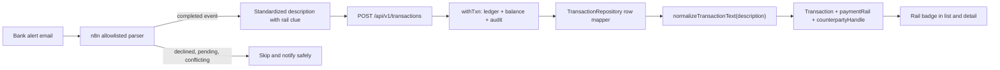

# Payment-rail visibility for transactions

- **Status:** Application implementation complete; n8n script update pending
- **Date:** 2026-08-02
- **Primary outcome:** show how money moved (UPI, card, NEFT, RTGS, IMPS, or NACH) without changing ledger direction or ingestion source
- **Code dependency:** PR #121, `feat/finance-02-narration-normalizer`, is merged as `c7446d3`
- **Coordination dependency:** [PR #123, email payment ingestion](https://github.com/Harsh71019/expense-tracker/pull/123), is **open**, not merged. Implement this plan after rebasing onto whichever version of PR #123 lands; do not duplicate its pending-transaction or mandate-matching work.
- **Operational reference:** `docs/EMAIL-INGESTION-N8N.md`
- **Related design on the PR branch:** `docs/plans/2026-08-02-email-ingestion-payment-context.md`

## Decision summary

Keep these three concepts independent:

| Concept              | Question answered                       | Values                                                   |
| -------------------- | --------------------------------------- | -------------------------------------------------------- |
| Transaction `type`   | What did the money do to the account?   | `expense`, `income`                                      |
| Transaction `source` | How did TreasuryOps receive the record? | `manual`, `csv_import`, `recurring`, `api`               |
| Payment `rail`       | How did the money move?                 | `upi`, `card`, `neft`, `rtgs`, `imps`, `nach`, `unknown` |

This first pass records explicit rail clues in the stored ledger description supplied by n8n, derives a typed read field from that description, and displays it. It does **not** add a database column or accept a caller-supplied `paymentRail` field.

That choice follows PR #123's ADR to derive payment context first. It is appropriate for visibility and private matching at this application's scale. It is not an authoritative, queryable evidence model: editing the description can change the derived rail, and SQL cannot filter by it efficiently. If durable source evidence or rail filtering becomes a requirement, implement PR #123's later `paymentContext` plus append-only `transaction_payment_evidence` design instead of adding mutable columns to `transactions`.

## Problem

The external n8n workflow already identifies templates such as `hdfc_upi_debit`, `hdfc_debit_card`, and `icici_credit_card`. That classification implicitly knows the rail, but Node 2 currently posts only:

```json
{
  "accountId": "...",
  "type": "expense",
  "amountMinor": 29900,
  "occurredAt": "2026-08-02T09:30:00+05:30",
  "description": "Blinkit"
}
```

The rail is lost because:

1. the current description often contains only a merchant name;
2. `CreateTransactionSchema` has no payment-context input;
3. `TransactionSchema` exposes no derived payment context; and
4. the web transaction row has no rail display.

The merged `normalizeTransactionText()` already derives conservative rail, VPA, reference, and counterparty clues from a description. It currently recognizes UPI, NEFT, IMPS, NACH, and card, but not RTGS. The application uses it for private matching, not for transaction API responses.

## Requirements

### Functional

- Supported n8n templates must emit a standardized description containing an explicit rail token.
- Transaction API responses must always include `paymentRail`; use `"unknown"` when evidence is absent or conflicting.
- Transaction API responses must always include `counterpartyHandle`; use `null` when no UPI VPA is safely derivable.
- UPI, card, NEFT, RTGS, IMPS, and NACH must have stable display labels.
- Transaction list and detail views must show the rail when it is known.
- Existing clients and requests that omit rail information must continue working.

### Non-functional

- No float money parsing, ledger mutation, or balance behavior changes.
- No new database migration in this pass.
- Derivation must be deterministic, synchronous, and side-effect free.
- Raw descriptions, VPAs, reference values, account suffixes, and email bodies must not be added to logs, metrics, or public notifications.
- Every Drizzle row leaving `TransactionRepository` must still be parsed through zod.
- Existing tenant scoping, idempotency, audit, reversal, and transfer behavior must remain unchanged.

## Non-goals

- Do not add payment rail to `TransactionTypeSchema` or `TransactionSourceSchema`.
- Do not let n8n send `userId`, `source`, a normalized counterparty key, or a direction hint.
- Do not persist `paymentRail`, VPA, RRN, UTR, or parser metadata in this pass.
- Do not add payment-rail filters or analytics yet; those need persisted/indexable evidence or a deliberate bounded-query design.
- Do not infer transaction direction from the rail. Parsed `type` remains authoritative.
- Do not alter CSV dedupe normalization. CSV rows may still derive a rail when their original narration contains a recognized marker.
- Do not build the pending-foreign-currency or mandate-matching features already present in PR #123.
- Do not add a manual payment-method selector in this pass. A selector implies durable explicit evidence and belongs with the future persisted model.

## Architecture



There are three independently testable delivery layers:

1. Extend the normalizer contract for RTGS.
2. Standardize n8n descriptions and expose derived fields on transaction reads.
3. Render the fields in the web app.

## Layer 1 — complete the rail vocabulary

### Shared schema

Update `packages/shared/src/transaction-text.ts`:

```ts
export const TransactionTextPaymentRailSchema = z.enum([
  "upi",
  "neft",
  "rtgs",
  "imps",
  "nach",
  "card",
  "unknown"
]);
```

Do not introduce a second hand-written rail union. All types and UI mappings must derive from this zod schema.

### Normalizer

Update `apps/api/src/common/transaction-text/normalize-transaction-text.ts`:

- add `rtgs` to `RAIL_MARKERS`;
- add `rtgs` to `TRANSPORT_NOISE`;
- add an `RTGS_ADAPTER` using the same conservative generic reference behavior as NEFT until real sanitized fixtures justify a rail-specific parser; and
- handle `rtgs` exhaustively in `adapterFor()`.

Keep abstention behavior: if one description contains markers for more than one rail, return `unknown` rather than guessing.

Add synthetic tests for `RTGS/DR/UTR:HDFC.../COUNTERPARTY` and a conflicting `RTGS NEFT ...` description. Never commit a real UTR or counterparty identifier.

## Layer 2 — n8n description contract

The actual n8n Code node scripts will be reviewed separately when supplied. Node 1 should remain the owner of bank-template parsing and should return both its internal `template` label and a standardized description. Node 2 should continue using the existing transaction endpoint; it must not send unsupported top-level fields.

### Description grammar

Use slash-delimited, uppercase transport tokens followed by the human-recognizable counterparty and only the source evidence actually present:

```text
<RAIL>/<DIRECTION>/<COUNTERPARTY>[/<REFERENCE-LABEL>:<REFERENCE>][/<VPA>]
```

Rules:

- `<RAIL>` is one of `UPI`, `CARD`, `NEFT`, `RTGS`, `IMPS`, or `NACH`.
- `<DIRECTION>` is `DR` or `CR`; it is supporting narration evidence and never replaces `type`.
- Preserve a short, recognizable merchant/counterparty label.
- Include a VPA only when the email template identifies it as a UPI VPA.
- Label references (`RRN:`, `UTR:`, `REF:`, or `mandate:`) instead of relying on a universal token position.
- Do not invent absent evidence. In particular, the current direct-card templates have no reference number.
- Sanitize `/`, repeated whitespace, control characters, and line breaks inside extracted merchant text so one field cannot break the grammar.
- Enforce the API's 500-character description limit before posting.
- Keep PR #123's exact `mandate:<id>` token convention; its tier-0 recurring matcher depends on the normalizer extracting that token.

### Current template mapping

| n8n template         | Rail   | Standardized description example                        |
| -------------------- | ------ | ------------------------------------------------------- |
| `hdfc_upi_debit`     | `upi`  | `UPI/DR/Blinkit/RRN:630934540626/blinkit.payu@hdfcbank` |
| `hdfc_upi_credit`    | `upi`  | `UPI/CR/HARSHKUMAR VINODBHAI PATEL/RRN:630934540626`    |
| `hdfc_debit_card`    | `card` | `CARD/DR/POS/HONEYCOMB TELNET PRIVA`                    |
| `hdfc_credit_card`   | `card` | `CARD/DR/HONEYCOMB TELNET PRIVA`                        |
| `icici_credit_card`  | `card` | `CARD/DR/<merchant>`                                    |
| `hdfc_emandate_paid` | `card` | `CARD/DR/EMANDATE/Anthropic/mandate:YIcCmzpAfi`         |

The examples use synthetic references. The real scripts must preserve current skip behavior for declined alerts, upcoming mandates, credit-card bill payments, unmatched templates, and unmapped account suffixes.

There are no NEFT, RTGS, IMPS, or NACH email templates documented in `docs/EMAIL-INGESTION-N8N.md` today. Do not relabel an unknown template merely to produce a badge. Add those rails only when a concrete allowlisted bank template and sanitized fixture are available.

### n8n verification fixtures

Before deploying the scripts, run the classifier against a sanitized fixture set that covers:

- one successful example per current template;
- declined and upcoming-mandate skips;
- credit-card bill-payment skips;
- unmapped last-four digits;
- malformed amount and date;
- a merchant containing punctuation or `/`;
- missing optional VPA/reference;
- replay of the same Gmail message id; and
- a description close to 500 characters.

The rail change must not weaken the PR #123 hardening requirements: use integer decimal parsing, a stable cryptographic UUID derived from the Gmail message identity, credentials stored in n8n Credentials, and safe notification text without VPA/reference leakage.

## Layer 3 — transaction response derivation

### Shared transaction response

Extend `TransactionSchema` in `packages/shared/src/transaction.ts` with required, derived response fields:

```ts
paymentRail: TransactionTextPaymentRailSchema,
counterpartyHandle: z.string().min(1).nullable()
```

Do not add these fields to `CreateTransactionSchema` or `UpdateTransactionSchema`. Requests remain backward compatible and cannot claim a rail independently of the source narration.

`TransactionPageSchema`, `TransferSchema`, and `TransferReversalSchema` already compose `TransactionSchema`, so the response change propagates to list, transfer, and reversal responses. Regenerate `apps/api/openapi.json` and `apps/web/src/lib/api/generated/schema.d.ts` with `pnpm gen:client`.

### Central repository mapper

The derivation belongs at the single database-row-to-domain seam in `apps/api/src/transactions/transaction.repository.ts`.

This is important: the repository currently calls `TransactionSchema.parse(stripNulls(row))` before a transaction reaches `TransactionService`. If the new response fields are required, a service-only enrichment helper would never run because repository parsing would fail first.

Introduce one local mapper and replace every direct transaction-row parse:

```ts
type TransactionRow = typeof transactions.$inferSelect;

function toTransaction(row: TransactionRow): Transaction {
  const normalized = normalizeTransactionText(row.description);
  return TransactionSchema.parse({
    ...stripNulls(row),
    paymentRail: normalized.paymentRail,
    counterpartyHandle: normalized.counterpartyHandle
  });
}
```

Use this mapper for all transaction-returning repository paths, including:

- create and idempotent replay;
- list and get;
- non-monetary update;
- single and bulk reversals;
- import-batch reads and inserted reversals;
- recurring/bill reconciliation candidate reads that return full transactions; and
- transfer-leg reads.

This makes omission impossible for transaction rows and automatically covers `TransactionService`, `TransferService`, import revert, reversals, and the API-key-created reconciliation hook without duplicating presentation logic across services.

For a reversal, the existing `Reversal: <original description>` convention retains the original rail marker, so the derived rail remains visible. No monetary or status fields change.

### Compatibility and fixture impact

Because the new response fields are required, typed test fixtures declared directly as `Transaction` must add:

```ts
paymentRail: "unknown",
counterpartyHandle: null
```

Fixtures parsed through `TransactionSchema` must also include the fields unless the implementation deliberately adds schema defaults. Prefer a shared test factory where practical, but do not weaken the production schema to optional merely to reduce test updates.

## Layer 4 — web visibility

Add a small reusable component or pure label helper under `apps/web/src/features/transactions/components/`.

| API value | Badge text     |
| --------- | -------------- |
| `upi`     | `UPI`          |
| `card`    | `Card`         |
| `neft`    | `NEFT`         |
| `rtgs`    | `RTGS`         |
| `imps`    | `IMPS`         |
| `nach`    | `NACH`         |
| `unknown` | render nothing |

Render the badge:

- beside the source badge in `txn-row.tsx`;
- in the metadata definition list in `txn-detail-drawer.tsx` and `txn-detail.tsx`; and
- once for a grouped transfer in `transfer-row.tsx` when both legs agree on a known rail.

If transfer legs disagree, render no rail badge and leave the raw descriptions available in the detail views. Do not guess between conflicting legs.

Show `counterpartyHandle` only in the authenticated transaction detail view, in muted text, when non-null. Do not put it in an aria label, notification, log, or list row; a VPA may be personally identifying and would make compact rows noisy.

The current UI displays the full stored description. Standardized n8n descriptions will therefore be more technical than today's bare merchant text. Keep this behavior for the first pass so the original evidence remains inspectable. A separate `displayDescription` or merchant-cleanup feature can be designed after seeing real sanitized output; do not silently strip narration tokens in this change.

## Delivery sequence

1. Rebase after the final PR #123 merge decision and resolve its generated OpenAPI/client changes first.
2. Add RTGS to the shared normalizer contract and tests.
3. Add derived transaction response fields and the central repository mapper.
4. Regenerate OpenAPI and the web client.
5. Add rail badges and detail-only VPA display.
6. Update the supplied n8n scripts and their sanitized classifier fixtures.
7. Update `docs/EMAIL-INGESTION-N8N.md` with the final grammar, template mapping, script version, and rollback instructions.
8. Deploy backend/web before n8n. Old descriptions return `unknown`; once n8n starts emitting standardized descriptions, badges appear without another app deploy.

## Testing plan

### Shared and normalizer

- `packages/shared/src/transaction-text.test.ts`: accept `rtgs`, reject unsupported values.
- `packages/shared/src/transaction.test.ts`: require valid derived fields in response rows; keep create/update requests unchanged.
- `apps/api/src/common/transaction-text/__tests__/normalize-transaction-text.test.ts`: every rail, RTGS, conflicting markers, UPI VPA, absent evidence.

### API unit and integration

- `apps/api/src/transactions/__tests__/transaction.repository.unit.test.ts`: central mapper derives the correct rail and handle.
- `apps/api/src/transactions/__tests__/transaction.repository.coverage.test.ts`: every row-returning branch uses the mapper.
- `apps/api/test/integration/transactions/transaction.service.integration.ts`: create, get, and list round trips return identical derived context.
- `apps/api/test/integration/transactions/ledger-conservation.integration.ts`: unchanged ledger invariants.
- `apps/api/test/integration/transactions/transfer.service.integration.ts`: both legs receive consistent derived context.
- Extend the HTTP e2e route coverage because the transaction response/OpenAPI contract changes.
- End every relevant integration/e2e test with `assertInvariants()` as required by `AGENTS.md`.

### Web

- `txn-row.test.tsx`: known rail badge and no badge for `unknown`.
- `txn-detail-drawer.test.tsx` and `txn-detail.test.tsx`: rail label and detail-only VPA.
- `transfer-row.test.tsx`: matching rail, unknown rail, and conflicting legs.
- Hook/server-fetch tests continue parsing the regenerated `TransactionSchema` response.

### n8n

- Run sanitized classifier fixtures before importing the workflow into production.
- Reprocess one already-seen Gmail message and verify the API reports an idempotent replay with no second ledger effect.
- Post one sanitized test per supported template to a non-production account mapping.
- Verify failure notifications do not include bearer tokens, account ids, VPAs, references, or raw RFC 7807 bodies.

### Full repository gate

```bash
pnpm lint
pnpm typecheck
pnpm test
pnpm test:integration
pnpm test:e2e
pnpm build
pnpm verify:migrations
```

No migration should be generated by this feature.

## Failure modes and recovery

| Failure                                    | Behavior and mitigation                                                                                                                                                                                                            |
| ------------------------------------------ | ---------------------------------------------------------------------------------------------------------------------------------------------------------------------------------------------------------------------------------- |
| Old/plain description has no rail marker   | Return `paymentRail: "unknown"`; render no badge.                                                                                                                                                                                  |
| Description contains multiple rail markers | Normalizer abstains with `unknown`; do not guess.                                                                                                                                                                                  |
| n8n extracts no VPA/reference              | Post the event with only supported evidence; rail can still be known.                                                                                                                                                              |
| n8n posts an incorrect rail token          | Do not edit monetary fields. Correct the parser for future alerts; if the transaction fact itself is wrong, reverse and repost. If only editable description metadata is wrong, use the existing audited non-monetary update path. |
| User edits away the rail marker            | Derived response becomes `unknown`; this is the accepted limitation of non-persisted evidence.                                                                                                                                     |
| API succeeds but ntfy fails                | Keep the committed transaction; notification retry must not repeat the transaction POST.                                                                                                                                           |
| App deploy precedes n8n deploy             | Existing transactions remain valid and quietly show no badge.                                                                                                                                                                      |
| n8n deploy precedes app deploy             | Standardized descriptions are still valid existing request data; badges appear after app deployment. Preferred order remains app first.                                                                                            |
| PR #123 changes generated artifacts        | Rebase, regenerate once, and resolve semantically; do not hand-merge generated OpenAPI types.                                                                                                                                      |

## Acceptance criteria

1. UPI descriptions return `paymentRail: "upi"`; a valid VPA is returned only when safely derivable.
2. Debit-card, credit-card, and paid card e-mandate descriptions return `paymentRail: "card"`.
3. NEFT, RTGS, IMPS, and NACH descriptions return their matching rail in synthetic tests.
4. Plain, unsupported, or conflicting descriptions return `paymentRail: "unknown"` and `counterpartyHandle: null` without throwing.
5. Create, replay, list, get, update, reverse, import-revert, and transfer response paths all satisfy `TransactionSchema` with the derived fields present.
6. The transaction list shows a compact badge for known rails and nothing for `unknown`.
7. Transaction detail views show the rail and show a non-null VPA only to the authenticated user.
8. Existing n8n request bodies remain valid; the workflow changes only description construction and parser hardening.
9. No database migration, balance change, transaction mutation, or new dependency is introduced.
10. Existing PR #123 mandate-token matching continues to recognize the exact `mandate:<id>` convention.

## Architecture decisions

### ADR-1: Payment rail remains separate from direction and source

**Decision:** Keep `type`, `source`, and `paymentRail` as independent dimensions.

**Consequence:** UPI credits, card refunds, transfers, and API-created entries remain representable without corrupting accounting meaning.

### ADR-2: Derive visibility before persisting evidence

**Decision:** Store explicit clues in the n8n-supplied description and derive typed response fields using the versioned normalizer.

**Positive:** No migration, backward-compatible requests, one reusable parser, and immediate visibility.

**Negative:** Description edits can change the derived rail, SQL filtering is unavailable, and the standardized description is more technical.

**Alternative considered:** A `paymentRail` column on `transactions`. Rejected because it mixes source evidence into the core ledger row and does not capture provenance or references. If persistence becomes necessary, use the append-only one-to-one evidence model from PR #123.

### ADR-3: Enrich in the repository row mapper

**Decision:** Derive fields at the central `TransactionRepository` mapper immediately before `TransactionSchema.parse()`.

**Reason:** Every transaction row already crosses this boundary, including service, reversal, transfer, and import paths. Service-only enrichment would fail after making the fields required because repository parsing occurs first.

### ADR-4: Abstention is a valid result

**Decision:** `unknown` is returned for absent or conflicting evidence, and the web renders no badge.

**Reason:** A missing badge is safer than confidently displaying the wrong payment rail.
