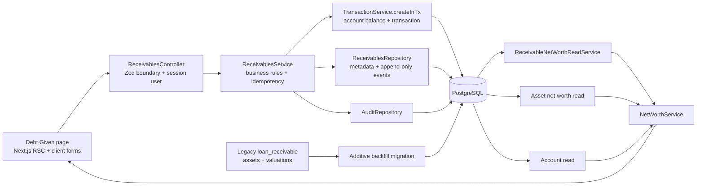

# Debt Given (Receivables) and Partial Repayments — Backend and Frontend Plan

**Status:** Proposed implementation plan

**Date:** 2026-08-22

**Scope:** Planning only; this document does not implement schema, API, or UI changes.

## 1. Outcome

Create a dedicated **Debt Given** feature for money the user has lent to another person. A debt can be repaid in any number of partial installments, and every installment updates both the real account balance and the outstanding receivable atomically.

Existing `loan_receivable` assets must move into this experience automatically. They must stop appearing in the Assets manager, but their current outstanding value must continue to count positively in net worth.

The acceptance journey is:

1. The user records ₹10,000 lent to Rohan from a bank account.
2. The bank account falls by ₹10,000 and Debt Given shows ₹10,000 outstanding.
3. Net worth is unchanged because cash became a receivable.
4. Rohan returns ₹2,500 into a selected account.
5. The account rises by ₹2,500 and the receivable falls to ₹7,500 in the same database transaction.
6. More installments can be recorded until the balance reaches exactly zero.
7. At zero, the debt is shown as settled without deleting its history.
8. A previously created `loan_receivable` asset appears under Debt Given after deployment, no longer appears under Assets, and produces the same net-worth value as before migration.

## 2. Terminology and product boundaries

The repo currently uses “debt” for two different directions. The implementation and UI must keep them unambiguous.

| Product term            | Direction                                       | Canonical model                                                                   | Location                     |
| ----------------------- | ----------------------------------------------- | --------------------------------------------------------------------------------- | ---------------------------- |
| Debt Given / receivable | Another person owes the user                    | New receivable and append-only receivable events                                  | New `/debts-given` page      |
| Debt Owed / liability   | The user owes another party                     | Existing `declared_debts`, optionally linked to a negative `loan_liability` asset | Settings → Protection & Debt |
| Asset                   | FD, gold, silver, investment, or loan liability | Existing `net_worth_assets` and valuations                                        | `/assets`                    |

The existing `declared_debts` module is not reused for Debt Given. It is planning metadata about liabilities, while Debt Given is a positive economic asset with real incoming and outgoing cash movements.

### In scope

- A separate Debt Given route and navigation item.
- Recording money lent now from an account.
- Recording an already-existing outstanding balance without changing an account.
- Any number of partial principal repayments.
- Creating a repayment transaction or linking an existing posted income transaction.
- Derived outstanding balance and settled state.
- Append-only correction events instead of editing money fields.
- Automatic migration of all legacy `loan_receivable` assets and their valuation changes.
- Current and historical net-worth inclusion.
- Excluding receivable principal movements from spending, earned-income, budget, and warning analytics.
- Reversal-safe behavior, idempotency, tenancy, audit, and concurrency coverage.

### Explicitly out of scope for the first release

- Interest schedules, EMI amortization, compounding, penalties, and tax treatment.
- Splitting one received transaction into principal and interest. In v1 a linked repayment transaction is entirely principal; interest is recorded as a separate ordinary income transaction.
- Automated reminders or messages to borrowers.
- Contacts/address-book integration.
- Multi-currency receivables.
- Joint lenders, guarantors, collateral, or legal-document storage.
- Deleting receivables or repayment history.
- Treating a write-off as an ordinary correction. A later design must define its expense/reporting semantics.
- Linking an old expense transaction as the initial disbursement. Historical debts use the opening-balance mode; this avoids unsafe interactions with import-batch reversal in v1.

## 3. Verified current state

Today:

- `AssetKindSchema` includes `loan_receivable` and `loan_liability` in `packages/shared/src/asset.ts`.
- Both are stored in `net_worth_assets`; point-in-time balances are stored in `asset_valuations`.
- `GET /api/v1/assets` returns open receivables together with every other asset.
- The Assets page exposes “Loan receivable” in the create form, filter bar, cards, and history drawer.
- A user can simulate a partial repayment only by manually adding a lower valuation. That records no incoming ledger transaction and gives no installment history.
- `NetWorthService` adds account balances and the latest valuation of every open asset.
- Dashboard net-worth history independently reads asset valuations in `DashboardRepository.assetsValueMinorAsOf`.
- Existing liability declarations under `/api/v1/financial-profile/debts` are planning-only and may link only to `loan_liability` assets.
- Transactions have only `expense` and `income` directions. Many reporting queries interpret all posted rows of those types as spending or earned income unless explicitly excluded.

This means simply adding a “repayment” valuation would remain incorrect: the account balance would not change. Simply adding an income transaction would also remain incorrect: net worth would rise and reports would call returned principal income. The feature needs an atomic account movement plus a receivable principal movement.

## 4. Requirements

### Functional requirements

- A receivable has a counterparty/display name, start date, optional due date, optional note, and an append-only money history.
- The current outstanding amount is derived from events; it is never a mutable balance column.
- A new loan can be captured as either:
  - **Lend now:** decrease an account and create the opening receivable atomically.
  - **Already lent:** create an opening balance without moving account cash.
- A repayment can be captured as either:
  - **Receive now:** increase an account and append the repayment atomically.
  - **Link existing deposit:** validate and attach an existing posted income transaction without changing the account again.
- Repayments may be smaller than the outstanding amount and repeated until zero.
- Overpayment is rejected; outstanding can never be negative.
- A zero balance is settled by derivation, not by deleting or rewriting history.
- A reversed repayment restores the outstanding amount.
- Legacy receivables are ported without duplicate net-worth contribution.
- Assets and Debt Given are separate management experiences.

### Non-functional requirements

- **Correctness:** integer paise only, safe-integer bounds, one Postgres transaction for every account/receivable/audit mutation, and no mutable monetary fields.
- **Idempotency:** every mutation uses `Idempotency-Key`; five identical concurrent attempts produce exactly one effect.
- **Concurrency:** row locking prevents distinct simultaneous installments from reducing a receivable below zero.
- **Tenancy:** every repository method accepts `userId` first and filters every table and joined transaction by it.
- **Performance:** all lists are cursor-paginated and outstanding totals are SQL-bounded; no user-wide transaction or event history is loaded into memory.
- **Privacy:** borrower names and notes never appear in logs, metrics, idempotency operation names, or audit metadata.
- **Availability and operations:** use the existing PostgreSQL, Drizzle, NestJS, generated client, and deployment topology; no new service or dependency is required.
- **Accessibility:** repayment and creation flows are keyboard reachable, use ≥44px mobile targets, expose status in text, and never use color alone.

## 5. High-level architecture



The dependency direction remains one-way:

```text
ReceivablesModule -> TransactionsModule -> AccountsModule / CategoriesModule
NetWorthModule -> AccountsModule + AssetsModule + ReceivablesModule
DashboardModule -> narrow asset and receivable read services
```

`TransactionsModule` must not import `ReceivablesModule`. Any reversal validation needed by the generic transaction reversal path uses an injected interface/token bound from the receivables side, following the existing transaction-created-hook pattern, or a plain repository policy function passed by the caller. Do not introduce a Nest circular dependency.

## 6. Domain invariants

These are implementation gates, not suggestions.

1. Every monetary value is a positive integer number of paise at input and a safe integer after aggregation.
2. `receivables` stores identity and editable non-monetary metadata only. It has no mutable `outstanding_minor` cache.
3. Every change to principal is an immutable `receivable_event`.
4. A manual event that moves cash links to exactly one transaction.
5. One transaction can be linked to at most one receivable event.
6. A posted opening/disbursement transaction must be an `expense`; a posted repayment transaction must be an `income`.
7. A linked transaction and its receivable belong to the same user.
8. Principal transactions carry internal purpose `receivable_principal` and are excluded from earned-income and spending analytics while remaining visible in the ledger.
9. Current outstanding is the sum of effective increases minus effective decreases.
10. A transaction-backed event stops being effective at the time its transaction is reversed; historical as-of reads still include it before that reversal time.
11. Outstanding may reach zero but never go below zero.
12. `status` is derived: `active` when outstanding is positive, `settled` when effective decreases repaid/adjusted it to zero, and `cancelled` when a cash-backed opening was reversed before any repayment.
13. Monetary corrections are compensating increase/decrease events with a reason; no event is updated or deleted.
14. Legacy asset rows and valuations remain stored for rollback/audit but are hidden from active asset APIs once their receivable backfill exists.
15. Current net worth is:

```text
sum(account balances)
+ sum(non-receivable asset latest values)
+ sum(receivable outstanding balances)
```

### Conservation examples

| Operation                  | Account delta | Receivable delta |                                                          Net-worth delta |
| -------------------------- | ------------: | ---------------: | -----------------------------------------------------------------------: |
| Lend ₹10,000 now           |      -₹10,000 |         +₹10,000 |                                                                       ₹0 |
| Receive ₹2,500 principal   |       +₹2,500 |          -₹2,500 |                                                                       ₹0 |
| Reverse that repayment     |       -₹2,500 |          +₹2,500 |                                                                       ₹0 |
| Record old ₹10,000 balance |            ₹0 |         +₹10,000 | +₹10,000, intentionally establishing previously untracked opening wealth |
| Correct balance down ₹500  |            ₹0 |            -₹500 |                                                                    -₹500 |

The “Already lent” mode must explain its effect: it does not touch an account and is appropriate only when account balances already reflect the historical cash movement.

## 7. Proposed data model

### 7.1 `receivables`

| Column              | Type                 | Rules                                                                       |
| ------------------- | -------------------- | --------------------------------------------------------------------------- |
| `id`                | UUID PK              | Random UUID                                                                 |
| `user_id`           | text FK              | Required; tenant owner                                                      |
| `counterparty_name` | text                 | Trimmed, 1–80 chars                                                         |
| `note`              | text nullable        | Trimmed, max 500; never logged                                              |
| `opened_at`         | timestamptz          | ISO UTC over the wire; calendar entry interpreted with existing IST helpers |
| `due_at`            | timestamptz nullable | Must not precede `opened_at`                                                |
| `legacy_asset_id`   | UUID nullable FK     | Unique partial index; links one migrated asset to one receivable            |
| `created_at`        | timestamptz          | Required                                                                    |
| `updated_at`        | timestamptz          | Changes only for non-monetary metadata                                      |

Indexes:

- `(user_id, created_at DESC, id DESC)` for cursor listing.
- `(user_id, due_at)` partial where `due_at IS NOT NULL` for due-state reads.
- Unique partial `(legacy_asset_id)` where non-null.
- Optional unique `(user_id, legacy_asset_id)` is redundant if the global FK id is unique; prefer the simpler global partial unique index.

No `status`, `original_principal_minor`, `repaid_minor`, or `outstanding_minor` column is stored. Those values are derived from events so they cannot drift.

### 7.2 `receivable_events`

| Column                | Type             | Rules                                                                                                      |
| --------------------- | ---------------- | ---------------------------------------------------------------------------------------------------------- |
| `id`                  | UUID PK          | Random UUID                                                                                                |
| `user_id`             | text FK          | Required and repeated for tenant-scoped indexes/filters                                                    |
| `receivable_id`       | UUID FK          | Required; parent owner must match in service/repository filters                                            |
| `kind`                | enum             | `opening`, `repayment`, `correction_increase`, `correction_decrease`, `legacy_increase`, `legacy_decrease` |
| `amount_minor`        | bigint/number    | Positive safe integer paise                                                                                |
| `occurred_at`         | timestamptz      | Business effective time                                                                                    |
| `transaction_id`      | UUID nullable FK | Required for cash-moving manual opening/repayment; null for opening-balance, correction, and legacy events |
| `legacy_valuation_id` | UUID nullable FK | Set only on migrated valuation-derived events                                                              |
| `reason`              | text nullable    | Required for correction events, max 300                                                                    |
| `created_at`          | timestamptz      | Immutable insertion time                                                                                   |

Constraints and indexes:

- CHECK `amount_minor BETWEEN 1 AND Number.MAX_SAFE_INTEGER`.
- Unique partial `transaction_id` where non-null.
- Unique partial `legacy_valuation_id` where non-null.
- `(user_id, receivable_id, occurred_at DESC, id DESC)` for event pages.
- A manual repayment requires a transaction; a legacy event requires legacy provenance. Mirror these combinations in Zod and SQL CHECK constraints where PostgreSQL can enforce them locally.
- Cross-table direction, status, and tenant checks remain service rules because a CHECK constraint cannot inspect the transaction row.

### 7.3 `transactions.purpose`

Add an internal transaction-purpose enum and non-null column:

```text
ordinary | receivable_principal
```

Existing rows backfill/default to `ordinary`. Public transaction creation never accepts this field; only trusted internal services may create or change `receivable_principal`.

This field is intentionally separate from:

- `type`, which still determines the account balance sign;
- `source`, which describes manual/import/API origin;
- `transfer_group_id`, which identifies account-to-account transfers;
- `category_id`, which remains user classification metadata.

All reporting eligibility helpers must exclude `purpose = receivable_principal`. The transaction remains visible in account and transaction history with a Debt Given/Repayment badge.

## 8. Effective-balance calculation

Event signs are fixed by kind:

| Kind                  | Principal effect |
| --------------------- | ---------------: |
| `opening`             |   `+amountMinor` |
| `correction_increase` |   `+amountMinor` |
| `legacy_increase`     |   `+amountMinor` |
| `repayment`           |   `-amountMinor` |
| `correction_decrease` |   `-amountMinor` |
| `legacy_decrease`     |   `-amountMinor` |

For the current balance, a transaction-backed event contributes only while its linked original transaction is effective. For an as-of balance:

- the event contributes after `event.occurred_at`/the linked transaction occurrence;
- it continues contributing while no reversal has occurred;
- if `transactions.reversed_by` points to a reversal transaction, the original effect stops at the reversal transaction’s `occurred_at`;
- transactionless opening/correction/legacy events contribute from their own `occurred_at` onward.

This avoids the historical bug that would occur if an old event were omitted solely because its transaction is currently marked `reversed`.

Repositories should aggregate in SQL and parse the bigint result through shared safe-integer helpers. The detail response may calculate `balanceAfterMinor` for a bounded event page, but the canonical total comes from the aggregate query.

## 9. Shared Zod contracts

Create `packages/shared/src/receivable.ts` and export all schemas/types through `packages/shared/src/index.ts`.

Proposed contracts:

- `ReceivableIdSchema`
- `ReceivableStatusSchema` — derived `active | settled | cancelled`
- `ReceivableEventKindSchema`
- `ReceivableEventSchema`
- `ReceivableSchema`
- `ReceivablePageSchema`
- `ReceivableEventPageSchema`
- `ListReceivablesQuerySchema`
- `ListReceivableEventsQuerySchema`
- `CreateReceivableSchema`
- `UpdateReceivableMetadataSchema`
- `RecordReceivableRepaymentSchema`
- `CreateReceivableCorrectionSchema`
- `ReceivableMutationResultSchema`
- `NetWorthReceivableSchema`

`CreateReceivableSchema` should be a discriminated union:

```text
fundingMode = "lend_now"
  counterpartyName, principalMinor, accountId, openedAt, dueAt?, note?, description

fundingMode = "opening_balance"
  counterpartyName, outstandingMinor, openedAt, dueAt?, note?
```

`RecordReceivableRepaymentSchema` should also be a discriminated union:

```text
captureMode = "receive_now"
  accountId, amountMinor, occurredAt, description

captureMode = "link_existing"
  transactionId
```

For `link_existing`, the API takes the amount/date/account from the validated transaction. The client must not send a duplicate amount that could disagree.

`ReceivableSchema` should expose at least:

```text
id, counterpartyName, note?, openedAt, dueAt?,
outstandingMinor, confirmedRepaidMinor, repaymentCount,
status, isMigrated, createdAt, updatedAt
```

Do not label legacy valuation decreases as confirmed repayments. They change outstanding but remain “Imported balance adjustment” events.

Extend `NetWorthSchema` additively with:

```text
receivables: [{ receivableId, counterpartyName, outstandingMinor, asOf }]
```

The `assets` array no longer includes active legacy `loan_receivable` rows after backfill. Keep `AssetKindSchema` capable of parsing `loan_receivable` for stored history and compatibility; introduce a narrower create/manage schema rather than pretending the PostgreSQL enum value never existed.

## 10. Backend API

All routes live under `/api/v1/receivables` even though the UI label is “Debt Given”. “Receivable” is the precise resource name and avoids direction ambiguity in code.

| Method  | Route                                       | Purpose                                                            |
| ------- | ------------------------------------------- | ------------------------------------------------------------------ |
| `GET`   | `/v1/receivables`                           | Cursor page filtered by `active`, `settled`, `cancelled`, or `all` |
| `POST`  | `/v1/receivables`                           | Record opening balance or lend now                                 |
| `GET`   | `/v1/receivables/:receivableId`             | Current detail and derived totals                                  |
| `PATCH` | `/v1/receivables/:receivableId`             | Edit counterparty, note, or due date only                          |
| `GET`   | `/v1/receivables/:receivableId/events`      | Cursor-paginated immutable history                                 |
| `POST`  | `/v1/receivables/:receivableId/repayments`  | Receive now or link an existing income transaction                 |
| `POST`  | `/v1/receivables/:receivableId/corrections` | Append a reasoned balance correction                               |

Every `POST` and `PATCH` requires `Idempotency-Key`. New routes must declare `operationId`s, RFC 7807 responses, auth, and idempotency replay headers in OpenAPI. Regenerate the web client after the shared/OpenAPI change.

### 10.1 Create with `lend_now`

Inside one `IdempotencyPostgresService.execute` / `withTxn` callback:

1. Validate the account belongs to the session user and is active.
2. Lock the account through the existing balance update path.
3. Create a posted `expense` transaction with purpose `receivable_principal`.
4. Apply `-principalMinor` to `accounts.balanceMinor`.
5. Insert receivable metadata.
6. Insert one `opening` event linked to the transaction.
7. Write transaction and receivable audit entries without counterparty, note, or amount metadata.
8. Return the receivable plus the created transaction id.

Do not call `TransactionService.create`, which would open a nested transaction. Extract/reuse a typed `createInTx` core or a narrow ledger-posting service that accepts the caller’s `DbTx` and enforces the same account/category/audit rules.

### 10.2 Create with `opening_balance`

Inside one idempotent transaction:

1. Insert receivable metadata.
2. Insert a transactionless `opening` event for the current outstanding amount.
3. Audit the entity shape only.

No account is read or changed. The API response and UI confirmation must state that net worth rose because previously untracked money owed to the user was added.

### 10.3 Receive a partial repayment now

Inside one idempotent transaction:

1. Lock the receivable row (`SELECT ... FOR UPDATE`) for this user.
2. Derive its current effective outstanding inside the same transaction.
3. Reject `amountMinor > outstandingMinor` with a domain problem such as `receivable.overpayment`.
4. Validate the destination account.
5. Create a posted `income` transaction with purpose `receivable_principal`.
6. Apply `+amountMinor` to the account balance.
7. Append a `repayment` event linked to that transaction.
8. Audit both writes.
9. Return the refreshed receivable, event, and transaction id.

If the result is zero, no separate close update occurs. The response simply derives `status: settled`.

### 10.4 Link an existing deposit

Inside one idempotent transaction:

1. Lock the receivable.
2. Load the candidate transaction by `userId` and id.
3. Require `type = income`, `status = posted`, `transferGroupId = null`, and no existing receivable link.
4. Reject an amount greater than current outstanding.
5. Change only the transaction’s non-monetary internal purpose from `ordinary` to `receivable_principal` and audit that classification change.
6. Append the repayment event using the transaction’s amount and occurrence time.
7. Invalidate/recompute affected cached monthly rollup data so historical income totals no longer count the principal as earnings.

The account balance is not changed because the existing transaction already changed it.

### 10.5 Corrections

Corrections never edit an existing event. The endpoint appends `correction_increase` or `correction_decrease` with a required reason.

- Lock and recompute before a decrease.
- Reject a decrease that would make the balance negative.
- Do not attach a transaction because no cash moved.
- Clearly label the net-worth effect in the UI.
- A mistake in a correction is fixed with another compensating correction.

Write-off/forgiveness is not a correction option in v1.

## 11. Reversal behavior

Repayment transactions remain reversible through the existing transaction flow.

- Reversing a repayment removes its negative principal effect from the current receivable balance, so outstanding rises by the same amount.
- Reversing a `lend_now` opening removes its positive principal effect. It is allowed only if the resulting receivable balance remains non-negative.
- If partial repayments already exist, reversing the opening would normally produce a negative result and must fail with a receivable-specific domain problem. The user reverses dependent repayments first.
- Reversal must remain one Postgres transaction: reversal transaction, original status, account delta, audit, and receivable policy check succeed or fail together.

The existing `reverseTransactionInTx` and bulk import-reversal paths must be audited. A small injected `TransactionReversalPolicy` interface can validate linked receivable effects without making `TransactionsModule` import `ReceivablesModule`. Every reversal entry point—not only the HTTP controller—must invoke the policy.

Integration coverage must prove historical as-of balance before and after reversal time.

## 12. Reporting and derived-data impact

Principal movement is balance-sheet movement, not income or consumption. Add one reusable repository-level eligibility condition for `transactions.purpose = ordinary`, then audit every aggregate that currently interprets `type` as financial meaning.

At minimum inspect and test:

- `reports/monthly-rollup.repository.ts`
- `dashboard/dashboard.repository.ts`
- dashboard spent, income, savings rate, cash-flow, spend mix, and top spending
- `budgets/budget.repository.ts`
- `financial-safety/essential-burn.repository.ts`
- spending warnings and spending-change detection
- recurring detection and cash-flow forecasting
- transaction insights and category rollups
- goals that derive progress from tagged transactions

Account balance reconstruction must continue including receivable-principal transactions because the cash really moved. Only income/spend interpretation excludes them.

### Net worth

Move net-worth orchestration into a dedicated `NetWorthModule` or otherwise expose narrow read services so Assets does not own Receivables.

`GET /v1/net-worth` should return three explicit breakdowns:

- accounts;
- non-receivable assets/liabilities;
- receivables.

`netWorthMinor` sums all three. The Assets page hero should say “accounts + assets + debt given” rather than silently folding receivables back into the asset-manager count.

Dashboard historical net-worth reads must add `receivablesOutstandingMinorAsOf(userId, asOf)` and exclude legacy `loan_receivable` valuations that have been backfilled. Tests must cover a month containing a partial repayment and a later reversal.

## 13. Legacy asset migration

The migration is automatic and additive. Do not delete legacy assets, delete valuations, remove the PostgreSQL enum value, or close rows merely to hide them.

### 13.1 Expand and backfill

One generated Drizzle migration should:

1. Add the receivable enums, tables, indexes, checks, and `transactions.purpose` with existing rows defaulted to `ordinary`.
2. Select every `net_worth_assets.kind = 'loan_receivable'`, including closed rows.
3. Insert one receivable per asset using:
   - `counterparty_name = asset.name`;
   - `opened_at = asset.opened_at`;
   - `legacy_asset_id = asset.id`;
   - `note = NULL`, `due_at = NULL`.
4. Order each asset’s valuations deterministically by `(valued_at ASC, id ASC)`.
5. Convert the first positive balance to a legacy `opening`/increase effect and each later non-zero balance delta to `legacy_increase` or `legacy_decrease`.
6. Skip zero deltas; retain the untouched old valuation rows as the raw historical source.
7. For a closed legacy asset whose final derived balance is positive, append a final `legacy_decrease` at `asset.updated_at` so its migrated current balance remains zero. `updated_at` is usable because current asset code changes it on close, not on valuation insertion.
8. Preserve a `legacy_valuation_id` on valuation-derived events for deterministic rerun protection.
9. Abort on impossible source data: negative receivable valuation, missing tenant, unsafe integer, or a delta sequence that would produce a negative running balance.

The backfill must be deterministic and guarded by the unique `legacy_asset_id`/`legacy_valuation_id` indexes. A migration verification query compares, per user:

```text
current value of open legacy loan_receivable assets
= current outstanding of migrated active receivables
```

and compares net worth before and after the application cutover.

### 13.2 Application cutover

After the migration has committed, new code:

- excludes backfilled `loan_receivable` rows from `GET /assets`;
- rejects valuation/close operations on a moved legacy receivable with `asset.moved_to_receivables` and its receivable id;
- excludes those legacy rows from current and historical asset net-worth reads;
- includes their new receivable balances instead;
- removes “Loan receivable” from the Assets UI create/filter options;
- exposes every migrated row on Debt Given with an “Imported from Assets” badge.

### 13.3 API compatibility

`AssetKindSchema` must continue parsing `loan_receivable` because stored rows and old response artifacts exist. Narrowing the public `CreateAssetSchema` immediately may be detected as a breaking OpenAPI change.

Use a staged compatibility path:

1. The new web UI stops offering the legacy kind.
2. Mark legacy asset creation deprecated in the OpenAPI description.
3. During the v1 compatibility window, a `POST /assets` request with `kind = loan_receivable` delegates atomically to a compatibility adapter that creates the legacy anchor and corresponding receivable, while normal reads expose it only through `/receivables`.
4. Remove the old create value only in an intentionally versioned API change.

If maintaining that adapter is judged too costly, explicitly approve the `oasdiff` breaking change rather than silently weakening CI.

### 13.4 Rollback

Because legacy rows and valuations remain untouched, rolling application code back before any new receivable writes restores the old view correctly. After users create or repay receivables in production, database rollback is not safe: old code cannot understand the new events. At that point use roll-forward only, or disable receivable writes during rollback.

## 14. Backend structure and file plan

### New files

```text
packages/shared/src/receivable.ts
apps/api/src/common/db/schema/receivable.ts
apps/api/src/receivables/receivables.module.ts
apps/api/src/receivables/receivables.controller.ts
apps/api/src/receivables/receivables.service.ts
apps/api/src/receivables/receivables.repository.ts
apps/api/src/receivables/receivable-policy.ts
apps/api/src/receivables/receivable-net-worth-read.service.ts
apps/api/src/receivables/receivable-transaction-reversal-policy.ts
apps/api/src/net-worth/net-worth.module.ts
apps/api/src/net-worth/net-worth.controller.ts
apps/api/src/net-worth/net-worth.service.ts
apps/api/src/common/errors/receivable-*.ts
apps/api/drizzle/<generated-additive-migration>.sql
```

Add colocated unit tests and integration tests under the existing test layout.

### Existing files likely to change

```text
packages/shared/src/index.ts
packages/shared/src/asset.ts
apps/api/src/common/db/schema/enums.ts
apps/api/src/common/db/schema/transaction.ts
apps/api/src/common/db/schema/index.ts
apps/api/src/app.module.ts
apps/api/src/assets/asset.repository.ts
apps/api/src/assets/asset.service.ts
apps/api/src/assets/assets.module.ts
apps/api/src/assets/net-worth.service.ts          # moved or reduced to read adapter
apps/api/src/assets/net-worth.controller.ts       # moved
apps/api/src/dashboard/dashboard.repository.ts
apps/api/src/dashboard/dashboard.service.ts
apps/api/src/transactions/transaction.service.ts
apps/api/src/transactions/transaction.repository.ts
apps/api/src/transactions/reverse-transaction-in-tx.ts
apps/api/src/reports/monthly-rollup.repository.ts
apps/api/src/budgets/budget.repository.ts
apps/api/src/financial-safety/essential-burn.repository.ts
apps/api/src/openapi/registry.ts
```

Also audit every reporting repository listed in section 12; the final diff is determined by that audit, not by treating this list as exhaustive.

### Controller/service/repository responsibilities

- Controller: parse id, query, body, and idempotency header; call one service method; map Location/replay headers.
- Service: row-locking, amount rules, transaction orchestration, audit, and idempotency.
- Repository: the only receivable layer that imports Drizzle schema or query builders.
- Read service: narrow tenant-scoped aggregation for NetWorth and Dashboard consumers.
- No controller accepts `userId` from a body.

## 15. Frontend information architecture

### Route and navigation

Add `/debts-given` as a protected App Router route and add **Debt Given** beside Assets in configurable navigation. Use “Debt Given” in visible product copy and “receivable” in code/API names.

The page server-loads:

- the first active receivables page;
- current net-worth summary or receivable total summary;
- active destination/source accounts needed for the primary forms.

Do not move the existing Protection & Debt panel. That panel remains liabilities the user owes.

### Page layout

1. `PageHeader`: “Debt Given” and “Add debt” action.
2. Summary cards:
   - total outstanding;
   - confirmed principal returned;
   - active people/debts;
   - due/overdue count when dates exist.
3. Tabs or filter control: Active / Settled / All, represented in URL search params.
4. Receivable cards/table with counterparty, outstanding, opened date, optional due state, confirmed repayment count, and migrated badge.
5. Detail drawer on compact flows or detail route if history needs a stable shareable URL.

The first version should prefer a detail route `/debts-given/[receivableId]` if event pagination, transaction links, and correction actions make the drawer too dense. A small card can still open it without duplicating domain logic.

### Core components

```text
apps/web/src/features/receivables/
├── components/
│   ├── receivable-manager.tsx
│   ├── receivable-summary.tsx
│   ├── receivable-card.tsx
│   ├── create-receivable-sheet.tsx
│   ├── record-repayment-sheet.tsx
│   ├── link-existing-repayment.tsx
│   ├── receivable-event-list.tsx
│   ├── edit-receivable-sheet.tsx
│   └── correct-receivable-dialog.tsx
├── hooks/
│   ├── use-receivables.ts
│   ├── use-receivable.ts
│   ├── use-receivable-events.ts
│   └── use-receivable-mutations.ts
├── model/
│   ├── receivable-form.ts
│   └── receivable-presentation.ts
├── server/
│   └── get-receivables.ts
└── index.ts
```

Routes:

```text
apps/web/src/app/(app)/debts-given/page.tsx
apps/web/src/app/(app)/debts-given/[receivableId]/page.tsx
```

### Creation flow

The first choice is semantic, not a checkbox hidden at the bottom:

- **Lend money now** — asks for source account, amount, date, counterparty, optional due date/note, and transaction description. Confirmation states that cash will leave the account and net worth will remain unchanged.
- **Add money already lent** — asks for the current amount still owed, date, counterparty, optional due date/note. Confirmation states that no account will change and net worth will increase by the opening amount.

Generate the idempotency UUID when the sheet mounts and rotate it only after confirmed success.

### Repayment flow

Primary action: **Record repayment**.

Default mode is “Receive into account”:

- amount, capped at outstanding;
- destination account;
- received date;
- description default such as `Repayment from Rohan`.

Secondary mode is “Link an existing deposit”:

- query posted, unlinked income transactions;
- show account, date, description, and amount;
- disable candidates greater than outstanding with text explaining why;
- confirm that no account balance will change again.

When amount equals outstanding, show “This will settle the debt” before submit. After success, announce the new outstanding amount through the existing toast facade and an accessible live region.

### History presentation

Use text labels that communicate financial meaning:

- Lent / opening balance
- Partial repayment
- Full repayment
- Repayment reversed
- Balance correction increase/decrease
- Imported balance adjustment

Each cash-backed event links to its transaction detail. Reversed events remain visible with their amount struck or muted and an explicit “Reversed” label; never remove them from history.

For migrated items, do not infer that a lower valuation was a confirmed repayment. Show “Imported balance adjustment” and offer a one-time metadata cleanup prompt for the counterparty name and due date.

## 16. Frontend data and cache plan

Add centralized query keys:

```text
qk.receivables()
qk.receivableList(filters)
qk.receivable(receivableId)
qk.receivableEvents(receivableId)
```

Use generated-client calls only. Parse responses with shared Zod schemas; do not cast generated JSON.

Mutation invalidation:

| Mutation                   | Invalidate                                                                          |
| -------------------------- | ----------------------------------------------------------------------------------- |
| Create opening balance     | receivable lists/detail, net worth, dashboard stats                                 |
| Lend now                   | receivables, accounts, transactions, net worth, dashboard/rollup queries            |
| Receive repayment          | receivables, events, accounts, transactions, net worth, dashboard/rollup queries    |
| Link existing deposit      | receivables, events, transactions, dashboard/rollup queries                         |
| Edit metadata              | receivable lists/detail only                                                        |
| Correction                 | receivables, events, net worth, dashboard net-worth queries                         |
| Reverse linked transaction | transaction detail/list, receivables/events, accounts, net worth, dashboard/rollups |

Avoid optimistic money totals unless the hook can update account, receivable, and net-worth caches as one coherent snapshot. The safe first implementation uses a pending button/state and invalidates after the atomic server response.

## 17. Assets and net-worth UI changes

The Assets manager must:

- remove Loan receivable from new-asset choices;
- remove its filter chip and normal card rendering;
- keep loan liabilities, FDs, metals, and investments unchanged;
- show a small link to Debt Given if users look for money owed to them;
- handle `asset.moved_to_receivables` if a stale page tries to value a migrated asset.

The net-worth hero must separate the numbers:

```text
Net worth
Accounts + Assets + Debt given
```

Liabilities can remain a signed/negative asset breakdown, but “Debt given” uses a positive receivable count and links to `/debts-given`. The summed net-worth number must not change solely because of migration.

The dashboard net-worth card needs no new headline, but its current value and trend must use the new receivable read model.

## 18. UI states and accessibility

Required states:

- no receivables yet;
- active receivables;
- settled history;
- cancelled/reversed opening history;
- migrated receivable needing metadata review;
- partial repayment pending/success/failure;
- full repayment confirmation;
- overpayment validation;
- no active destination account;
- existing-transaction search empty/error;
- linked transaction reversed;
- stale data conflict after another tab records a repayment;
- correction confirmation with explicit net-worth effect.

Accessibility requirements:

- Amounts use `formatMinor()`/`SignedMoney`; never divide by 100 inline.
- Progress is described in text, not color alone.
- Due/overdue state includes text and a semantic badge.
- Sheet/dialog focus is trapped and restored.
- Validation errors are associated with fields and the first invalid field receives focus.
- All controls remain usable at 320px width and meet the existing mobile touch target.
- Reduced-motion preference applies to progress and sheet transitions.

## 19. Security, privacy, and audit

- Session ownership comes only from `@CurrentUser()`.
- Every receivable/event/transaction join includes the same `userId`.
- Cross-tenant ids return the existing not-found-style domain response; do not disclose existence.
- Runtime bodies, query strings, database rows leaving repositories, and idempotency replay payloads are Zod parsed.
- Borrower name and notes are personal data. Do not include them in pino fields, metrics labels, audit metadata, or problem details.
- Audit action names can include:
  - `receivable.create`
  - `receivable.metadata.update`
  - `receivable.repayment.create`
  - `receivable.repayment.link`
  - `receivable.correction.create`
  - `receivable.legacy.migrate`
- Audit metadata records ids, event kind, source mode, status transition, and whether it was migrated—never free text or amounts.
- No new env variables, secrets, external calls, or notification transport are required.

## 20. Failure modes and mitigation

| Failure                                                     | Risk                              | Mitigation                                                               |
| ----------------------------------------------------------- | --------------------------------- | ------------------------------------------------------------------------ |
| Account update succeeds but event insert fails              | Cash/receivable drift             | One `withTxn`; rollback both                                             |
| Same submit arrives five times                              | Duplicate installment             | Idempotency record and unique transaction/event link                     |
| Two distinct repayments race                                | Negative outstanding              | Lock receivable row, recompute in transaction, reject overflow           |
| Existing transaction linked twice                           | Two receivables claim one deposit | Partial unique index on `transaction_id`                                 |
| Repayment transaction reversed                              | Outstanding remains too low       | Effective-event/reversal-aware aggregation and cache invalidation        |
| Opening transaction reversed after repayments               | Negative principal                | Reversal policy rejects until dependent repayments are reversed          |
| Migration and old API overlap                               | New legacy asset misses backfill  | Migration first, compatibility adapter after cutover, unique legacy link |
| New and legacy models both count                            | Inflated net worth                | Exclude backfilled legacy ids and verify per-user equality               |
| Legacy valuation decrease mislabeled repayment              | False history                     | Use “Imported balance adjustment,” not confirmed repayment               |
| Linked imported deposit later reverted                      | Outstanding must rise             | Reversal-aware event semantics; integration test import-revert path      |
| Cached rollup still counts newly linked principal as income | Wrong reports                     | Invalidate/recompute affected IST month on link                          |
| Rollback after new writes                                   | Old app cannot see receivables    | Roll-forward after write enablement; document operational gate           |

## 21. Test plan

### Shared contract tests

- Discriminated creation and repayment modes.
- Positive safe-integer paise boundaries.
- Due date before opened date rejected.
- Correction reason required.
- Transport date coercion.
- Derived response schemas for active, settled, cancelled, migrated, and reversed events.

### Backend unit tests

- Event sign and effective-as-of policy.
- Partial and final repayment calculations.
- Overpayment and correction-underflow errors.
- Existing transaction eligibility.
- Transaction purpose classification.
- Reversal of repayment and guarded reversal of opening.
- Audit metadata contains no borrower, note, description, or amount.
- Controller parses unknown input and calls one service method.

### Integration tests

- `lend_now` changes account by `-X`, receivable by `+X`, and net worth by zero.
- Five identical `lend_now` requests create one transaction, receivable, event, account delta, and audit effect.
- Five identical repayment requests create one installment.
- Five distinct parallel repayments cannot collectively exceed outstanding.
- Three sequential partial repayments derive the exact remaining paise and settle only at zero.
- A failed event insert rolls back the account and transaction.
- Linking an existing deposit does not change the account twice.
- Cross-tenant account, transaction, receivable, and event access is rejected.
- Repayment reversal restores account/receivable conservation.
- Historical as-of net worth is correct before and after reversal time.
- Principal transactions are excluded from monthly income/spend, budgets, essential burn, warnings, and dashboard cash flow.
- Principal transactions remain included in account balance verification.
- Every test ends with the extended `assertInvariants()`.

### Migration tests

Use a pre-migration fixture with:

- open receivable with one valuation;
- open receivable with several increases/decreases;
- settled zero-valued receivable;
- closed receivable whose final valuation is non-zero;
- other asset kinds and a loan liability;
- two users with similarly named assets.

After migration assert:

- exactly one receivable per legacy asset;
- tenant ownership is preserved;
- deterministic event deltas reproduce each balance;
- closed legacy rows produce zero current outstanding;
- non-receivable assets are untouched;
- current net worth is identical before/after cutover;
- rerun guards prevent duplicate legacy rows/events.

### API/e2e tests

- Authenticated create, list, detail, metadata edit, repayment, correction, and history routes.
- Idempotency replay headers and mismatched-body conflict.
- Cursor pagination and status filters.
- RFC 7807 error codes.
- OpenAPI operation ids and tenancy probe discovery.
- Full browser flow: create ₹10,000, repay ₹2,500 and ₹7,500, observe settled history and unchanged net worth across each cash-backed step.

### Frontend tests

- Both creation modes and their explanatory copy.
- Amount field capped by outstanding.
- Exact final repayment message.
- Existing-deposit selection and disabled overpayment candidate.
- Migrated badges and non-repayment wording.
- Cache invalidation families.
- Error focus and idempotency-key reuse.
- Assets form no longer offers Loan receivable.
- Net-worth hero shows a separate Debt Given subtotal.
- `/debts-given` is included in route, nav, protected-route, and mobile-overflow tests.

## 22. Extended invariants

Extend integration `assertInvariants()` with receivable checks:

- every event parent and linked transaction belongs to the same user;
- no transaction is linked more than once;
- linked opening is expense and linked repayment is income;
- every linked transaction has purpose `receivable_principal`;
- every principal-purpose transaction has exactly one receivable event;
- no effective receivable running balance is negative;
- derived current status agrees with outstanding and opening/reversal history;
- migrated receivables have one unique legacy asset and legacy source rows remain unchanged;
- account opening balance plus all transaction/reversal deltas still equals cached account balance;
- current net worth equals accounts + non-receivable assets/liabilities + receivables.

## 23. Delivery sequence

### Phase 1 — Contracts and additive storage

- Add shared schemas and unit tests.
- Add Drizzle schema and generated migration.
- Backfill legacy receivables and add migration verification tests.
- Keep legacy asset data intact.

### Phase 2 — Backend write/read model

- Implement repository, effective-balance policy, service, controller, and errors.
- Add in-transaction ledger posting reuse.
- Add idempotency, row locks, audit, and transaction-purpose rules.
- Add reversal policy and analytics exclusions.
- Split net-worth orchestration and update dashboard history.
- Register OpenAPI, regenerate client, and pass tenancy probes.

### Phase 3 — Frontend feature

- Add route, nav entry, server loaders, query keys, and feature slice.
- Build creation, repayment, link-existing, detail/history, metadata, and correction flows.
- Update Assets and net-worth presentation.
- Add mock handlers/data and route/mobile coverage.

### Phase 4 — Rollout verification

- Compare per-user pre/post migration totals in staging.
- Run all invariant, concurrency, integration, and e2e suites.
- Deploy migration before enabling UI writes.
- Verify counts of migrated assets/receivables and zero net-worth deltas.
- Enable the new navigation item.

## 24. Definition of done

The implementation is complete only when:

- existing `loan_receivable` assets appear in Debt Given and not in Assets;
- current net worth remains identical across migration;
- a user can record any number of partial repayments;
- each cash-backed operation conserves account + receivable net worth;
- principal is excluded from income/spending analytics;
- reversal and concurrency scenarios preserve a non-negative outstanding amount;
- no monetary history can be edited or deleted;
- all routes are tenant-scoped, idempotent, in OpenAPI, and covered by the tenancy probe;
- docs in `docs/backend/BACKEND.md` and `docs/frontend/FRONTEND.md` are updated during implementation;
- `pnpm gen:client` produces no uncommitted drift;
- `pnpm lint && pnpm typecheck && pnpm test && pnpm test:integration && pnpm test:e2e` all pass.

## 25. Architecture decisions

### ADR-DG-001: Model Debt Given as a receivable sub-ledger, not an asset valuation

**Status:** Proposed

**Context:** Valuations can state a lower balance but cannot prove or post the cash installment that caused it.

**Decision:** Store receivable identity separately and derive principal from immutable receivable events, with cash events linked to ledger transactions.

**Alternatives considered:** Keep adding valuations (rejected: no account movement or repayment semantics); create a hidden normal account per borrower (rejected: pollutes account management and requires special account lifecycle rules); reuse `declared_debts` (rejected: wrong direction and planning-only semantics).

**Consequences:** Partial repayments become auditable and atomic. The cost is a new read model and explicit integration with reversal/reporting paths.

### ADR-DG-002: Keep receivables separate in management UI but include them in net worth

**Status:** Proposed

**Context:** A receivable is economically an asset, but managing borrowers/installments inside the valuation-oriented Assets UI is confusing.

**Decision:** Add `/debts-given`, remove receivables from the Assets manager, and expose a separate receivable breakdown in the same net-worth total.

**Alternatives considered:** Keep one Assets page with another filter (rejected: preserves the current conceptual confusion); exclude Debt Given from net worth (rejected: understates assets).

**Consequences:** Navigation and response breakdown grow slightly, while financial meaning becomes clearer and the total remains complete.

### ADR-DG-003: Treat principal movements as balance-sheet transfers, not income or spending

**Status:** Proposed

**Context:** Transaction direction is needed to update a bank account, but direction alone incorrectly makes lending an expense and returned principal income.

**Decision:** Add an internal `transactions.purpose = receivable_principal` classification and exclude it from consumption/earned-income analytics while retaining it in account history and balance reconstruction.

**Alternatives considered:** Use ordinary categories (rejected: users can recategorize and reports still drift); use `transfer_group_id` with a missing second account leg (rejected: violates transfer pairing invariants); do not post transactions (rejected: account balances become wrong).

**Consequences:** Reporting repositories need a deliberate eligibility audit. In return, net worth and cash balances conserve correctly.

### ADR-DG-004: Derive outstanding and lifecycle state from append-only events

**Status:** Proposed

**Context:** A mutable outstanding column can drift from installment history during retries, reversals, or partial failures.

**Decision:** Store no mutable money cache on the receivable; aggregate immutable signed event effects and derive active, settled, or cancelled state from outstanding plus opening/reversal history.

**Alternatives considered:** Update `outstanding_minor` on every repayment (rejected: second source of truth); retain latest valuation as the balance (rejected: loses transaction linkage and installment meaning).

**Consequences:** Reads are more complex and require indexes/aggregation, but correctness and auditability are stronger at personal-finance scale.

### ADR-DG-005: Preserve legacy asset rows and migrate by deterministic valuation deltas

**Status:** Proposed

**Context:** Users already have receivables represented by valuation histories, and migrations are additive-only.

**Decision:** Backfill new receivable/event rows from ordered valuation deltas, retain the old rows untouched, and hide/count them through application cutover rules.

**Alternatives considered:** Delete or rename legacy rows (rejected by migration policy and rollback safety); copy only the latest value (rejected: discards useful history and historical net-worth shape); require manual recreation (rejected: user-visible data loss and effort).

**Consequences:** Migration logic and verification are more involved, but existing data ports automatically and rollback remains possible before new writes.

## 26. Stakeholder review points

The defaults in this plan are ready for implementation, but these product decisions should be explicitly accepted before coding:

1. Visible label is **Debt Given**, while API/code uses **receivables**.
2. V1 treats every repayment transaction as 100% principal; interest is a separate income transaction.
3. “Already lent” changes net worth without changing an account and therefore requires clear confirmation copy.
4. A zero balance settles automatically; there is no manual delete.
5. Write-off/forgiveness is deferred rather than disguised as a correction.
6. Legacy valuation decreases are shown as imported adjustments, not claimed as verified repayments.
7. Backward compatibility for legacy `POST /assets` receivable creation uses a temporary adapter unless an explicit versioned breaking change is approved.
